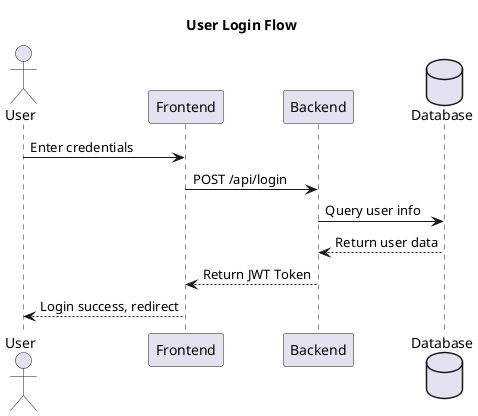
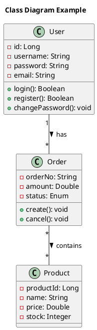
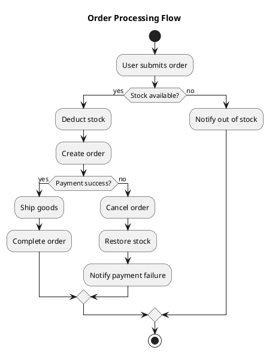
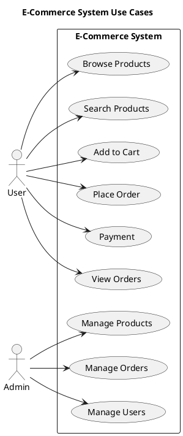
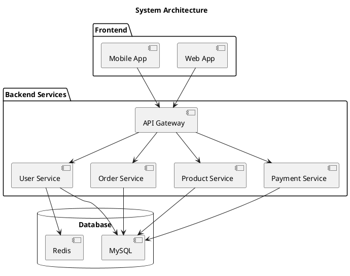
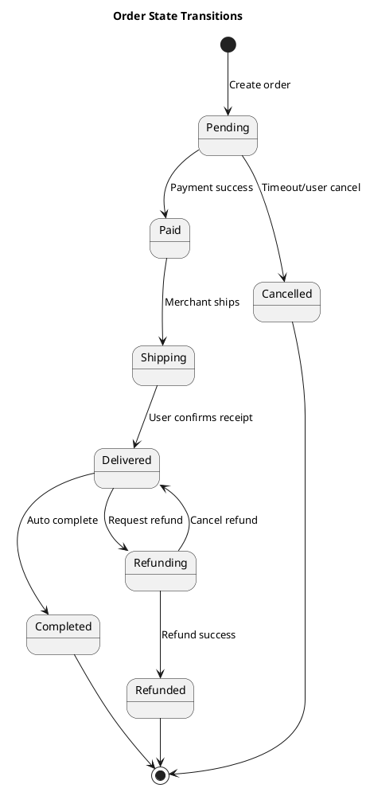

# PlantUML Converter

Convert PlantUML (.puml) files to image formats (PNG, SVG, PDF).

## When to Use

Use this skill when user requests:
- "convert puml", "render PlantUML", "generate image"
- "puml to png", "puml to svg"
- "export diagram", "render diagram"
- Any request involving converting .puml files to images

## Prerequisites

- **Java**: JRE 8+ (JDK 11+ recommended)
- **PlantUML.jar**: Rendering engine (auto-download available)

## Auto-Download

If `plantuml.jar` is not found, the `init-config` script will offer to download it automatically:

- **Source**: GitHub Releases
- **Location**: `<skill_dir>/lib/plantuml.jar`
- **Size**: ~8MB

**Version selection based on Java:**

| Java Version | PlantUML Downloaded |
|--------------|---------------------|
| Java 11+ | Latest (1.2026.x) |
| Java 8 | 1.2023.12 (last Java 8 compatible) |
| Unknown | Latest |

The download uses:
- Linux/Mac: `curl` or `wget`
- Windows: PowerShell or `curl`

## Compatibility

### Java Version Requirements

| PlantUML Version | Recommended Java |
|------------------|------------------|
| 1.2026.x (latest) | Java 11+ |
| 1.2024.x - 1.2025.x | Java 11+ |
| 1.2020.x - 1.2023.x | Java 8+ |
| 1.2019.x and earlier | Java 8+ |

### Known Compatibility Issues

| Issue | Cause | Solution |
|-------|-------|----------|
| `UnsupportedClassVersionError` | Java version too old for PlantUML | Upgrade Java to 8+ |
| `NoClassDefFoundError` | Corrupt jar or wrong Java | Re-download plantuml.jar |
| PDF generation fails | Missing Graphviz (for some diagrams) | Install Graphviz or use PNG/SVG |
| Emoji/special chars fail | Font missing in Java | Install required fonts or use `-charset UTF-8` |

### Version Check

The `check-env` script verifies:
1. Java installation and version (must be 8+)
2. PlantUML.jar existence
3. PlantUML version (optional)
4. Compatibility between Java and PlantUML

## Configuration

### Option 1: Config File (Recommended)

Edit `plantuml-config.json` in the skill directory (`<skill_dir>/plantuml-config.json`):

```json
{
  "plantumlJar": "C:/tools/plantuml/plantuml.jar",
  "javaPath": "C:/Program Files/Java/jdk-17/bin/java.exe"
}
```

### Option 2: Environment Variables

- `PLANTUML_LIB`: Full path to plantuml.jar
- `JAVA_HOME`: Java installation directory

### Priority

```
CLI arguments > Config file > Environment variables > System default java
```

## Usage

### Windows

**Step 1: Initialize Config**

```cmd
%SKILL_DIR%\scripts\init-config.bat
```

**Step 2: Check Environment**

```cmd
%SKILL_DIR%\scripts\check-env.bat
```

**Step 3: Convert Files**

```cmd
REM Single file
%SKILL_DIR%\scripts\convert.bat input.puml

REM Specify format
%SKILL_DIR%\scripts\convert.bat input.puml -f svg
%SKILL_DIR%\scripts\convert.bat input.puml -f png
%SKILL_DIR%\scripts\convert.bat input.puml -f pdf

REM Specify output
%SKILL_DIR%\scripts\convert.bat input.puml -o output.png

REM Batch convert
%SKILL_DIR%\scripts\convert.bat ./diagrams/ -r
```

### Linux/Mac

**Step 1: Initialize Config**

```bash
bash <skill_dir>/scripts/init-config.sh
```

**Step 2: Check Environment**

```bash
bash <skill_dir>/scripts/check-env.sh
```

**Step 3: Convert Files**

```bash
# Single file
bash <skill_dir>/scripts/convert.sh input.puml

# Specify format
bash <skill_dir>/scripts/convert.sh input.puml -f svg
bash <skill_dir>/scripts/convert.sh input.puml -f png
bash <skill_dir>/scripts/convert.sh input.puml -f pdf

# Specify output
bash <skill_dir>/scripts/convert.sh input.puml -o output.png

# Batch convert
bash <skill_dir>/scripts/convert.sh ./diagrams/ -r
```

### Direct Command (No Script)

When paths are known, call directly:

```cmd
REM Windows
java -jar C:\path\to\plantuml.jar -tpng diagram.puml

REM Linux/Mac
java -jar /path/to/plantuml.jar -tpng diagram.puml
```

## Command Arguments

| Argument | Description | Default |
|----------|-------------|---------|
| `input` | .puml file or directory | Required |
| `-f FORMAT` | Output format: png/svg/pdf | png |
| `-o OUTPUT` | Output file path | Same directory, same name as input |
| `-t THEME` | PlantUML theme | None |
| `-D KEY=VALUE` | PlantUML variable | None |
| `-r` | Recursive directory processing | false |
| `--config PATH` | Config file path | <skill_dir>/plantuml-config.json |
| `--plantuml PATH` | plantuml.jar path | Auto-detect |
| `--java PATH` | java path | Auto-detect |

**Default output behavior:** Without `-o`, the output file is generated in the same directory as the input file with the same base name.

```
diagram.puml  →  diagram.png
/path/to/arch.puml  →  /path/to/arch.png
```

## Character Encoding

All conversions use `-charset UTF-8` automatically to handle:
- CJK characters (Chinese, Japanese, Korean)
- Emoji and special symbols
- Unicode text in diagrams

If you still see garbled text, ensure your .puml file is saved with UTF-8 encoding.

## PlantUML Examples

### Sequence Diagram



### Class Diagram



### Activity Diagram



### Use Case Diagram



### Component Diagram



### State Diagram



## Conversion Examples

```cmd
REM Windows - Basic conversion
convert.bat architecture.puml

REM Windows - SVG format
convert.bat architecture.puml -f svg

REM Windows - Custom theme
convert.bat diagram.puml -t blueprint

REM Windows - Batch convert
convert.bat ./docs/ -r -f svg
```

```bash
# Linux/Mac - Basic conversion
bash convert.sh architecture.puml

# Linux/Mac - SVG format
bash convert.sh architecture.puml -f svg

# Linux/Mac - Custom theme
bash convert.sh diagram.puml -t blueprint

# Linux/Mac - Batch convert
bash convert.sh ./docs/ -r -f svg
```

## Troubleshooting

| Error | Solution |
|-------|----------|
| `java: command not found` | Install Java or configure javaPath |
| `plantuml.jar not found` | Configure plantumlJar or set PLANTUML_LIB |
| `Syntax error` | Check .puml file syntax |
| `Permission denied` | Check file permissions |

## Script List

| Script | Windows | Linux/Mac | Description |
|--------|---------|-----------|-------------|
| Init config | `init-config.bat` | `init-config.sh` | Auto-generate config file |
| Check env | `check-env.bat` | `check-env.sh` | Check Java and PlantUML |
| Convert | `convert.bat` | `convert.sh` | Main conversion function |
