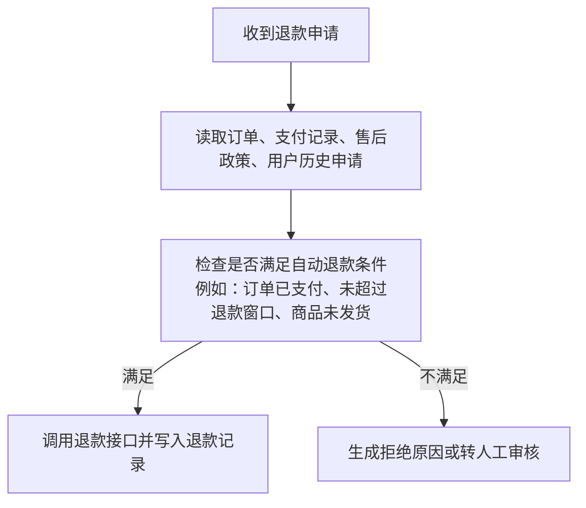
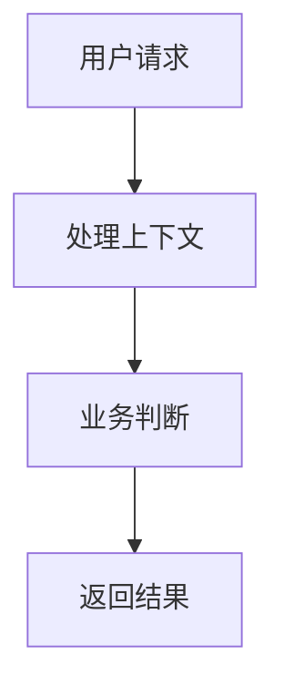
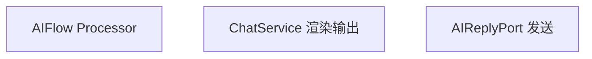
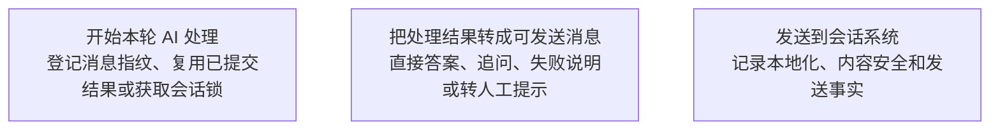
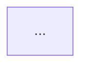

# Business Flow Mapper

Use this skill to reconstruct the current as-is business handling process and produce a Chinese Mermaid flowchart that is readable, concrete, and faithful to the source.

This is not a generic simplification skill. The job is to answer: "When this business event happens, what exactly does the system do, what does it check, what data does it read or write, what branches can happen, what loops exist, and what final result is produced?"

## Operating Rules

- Prefer current source evidence over memory: read relevant docs, code, tests, traces, configs, or examples before drawing the flow.
- Describe business actions, not internal class names. Keep function/class names only when useful for traceability, and prefer putting them in the evidence bullets rather than as primary flowchart node labels.
- Do not replace precision with vague wording. "整理上下文" is not enough; say what is read. "判断是否安全" is not enough; say what condition blocks or allows the flow.
- Preserve loops, retries, validation cycles, human review cycles, and tool/external-system execution cycles.
- Show failure and stop paths: blocked, unsupported, missing information, not found, policy boundary, timeout, duplicate, invalid state, manual handoff.
- If source evidence is incomplete, mark the gap explicitly instead of inventing a step.

## Workflow

1. Define the process boundary.
   Identify the trigger, entry point, main actor, systems involved, final output, and side effects.

2. Gather evidence.
   Search for docs, route/handler names, service names, worker/consumer names, domain terms, tests, traces, scenario files, configs, and persistence models related to the requested process.

3. Extract concrete stages.
   For each stage, capture:
   - input to the stage
   - checks or decisions made
   - data read or written
   - business action performed
   - output of the stage
   - branch or stop conditions

4. Identify loops.
   Look for planner/executor/evaluator loops, retries, polling, review cycles, state-machine transitions, pending-user-input flows, and multi-tool or multi-step workflows.

5. Draw the Mermaid flowchart.
   Use Chinese labels. Keep nodes concise but concrete. Use branch labels for conditions.

6. Explain the important mechanics after the chart.
   Keep this short: explain the loop, major branch conditions, key data sources, and final outputs.

7. Self-audit the chart before sending.
   Replace implementation-first labels with business-first labels. For example, change "AIFlow 回合" to "开始本轮 AI 处理", "ChatService 渲染输出" to "把处理结果转成可发送消息", and "AIReplyPort 发送" to "发送到会话系统". Internal names may appear in evidence bullets.

## Mermaid Requirements

Use `flowchart TD` unless the user asks otherwise.

Each node should name a concrete action:



Avoid nodes that only say:



Avoid implementation-first nodes unless the user explicitly asks for implementation-level diagrams:



Prefer business-first nodes:



Branch labels must name the condition:

- Good: `|缺订单号|`, `|命中人工接管|`, `|工具查到订单|`, `|超过退款窗口|`
- Poor: `|是|`, `|否|`, `|成功|`, `|失败|` unless the node already names the exact condition

## What To Include

Include these when present in the process:

- Trigger: user message, API request, event, scheduled job, queue message, admin action
- Admission checks: feature switch, permission, tenant/shop status, manual takeover, safety, idempotency, duplicate request
- Data preparation: exact business data read, such as order, payment, shipment, policy, conversation history, account, inventory, configuration
- Business decision: what condition decides the next branch
- Execution: internal service call, external API, tool call, database write, queue publish, notification, handoff
- Loop: repeated planning, retry, polling, validation, review, user补充信息, multi-step task execution
- Result assessment: success, no result, partial result, missing required information, policy boundary, invalid state, timeout
- Commit: what state is persisted, what event is emitted, what checkpoint or audit record is written
- Output: user reply, API response, status change, created task, handoff, scheduled follow-up

## Output Shape

Use this shape by default:

````markdown
下面是「xxx」当前业务处理流程的梳理，按现有代码/文档里的实际执行顺序画。



关键点：
- loop 是怎么结束的
- 哪些条件会中止或转人工
- 哪些数据会被读取/写入
- 最终会产出什么
````

If the user asks for a very concise answer, keep only the chart plus 3-5 bullets.

## AI Agent Business Flow Notes

When the requested process is an AI Agent reply flow, include these concrete stages if they exist:

- 是否允许进入 AI 回复：AI 开关、人工接管、会话状态、自动回复策略
- 内容安全或不确定性拦截：哪些情况固定拒答或停止
- 本轮资料读取：当前消息、最近历史、等待用户补充的信息、店铺/品牌/语言配置、可用工具
- AI 结构化理解：用户这句话的作用、和上一轮任务的关系、用户目标、已给信息、缺失信息
- 本轮主任务：回答、查订单、追问、拒绝、推荐、转人工等
- 受控思考 loop：决定下一步、检查能否执行、调用工具或跳过、观察结果、判断是否继续
- 工具执行：订单、知识库、商品、推荐、人工转接等具体工具
- 结果评估：查到、查不到、缺信息、政策不允许、需要第二步
- 最终回复：直接答案、追问、拒绝原因、查询结果、转人工建议
- 本地化：按用户语言输出但不改变业务含义

For "AI-native" explanations, say how the flow uses structured AI understanding to drive task choice, tool choice, follow-up questions, refusal, and final reply. Do not reduce it to "AI writes the final text."

## Quality Checklist

Before finalizing, verify:

- The chart starts at the real trigger and ends at the real output.
- Every decision branch has a condition label.
- Vague nodes are replaced with concrete data, checks, or actions.
- Loops in the real process are visible.
- External systems and tools are named by business category or actual system name.
- Failure and stop paths are included.
- The explanation distinguishes source-backed facts from assumptions.
- Flowchart node labels are business-first. Internal names such as Processor, Service, Port, GraphRun, ToolSpec, PrimaryMove, SemanticFrame, EvidenceLedger, or turn are only used when they add traceability and preferably appear in evidence notes, not as the main wording.
