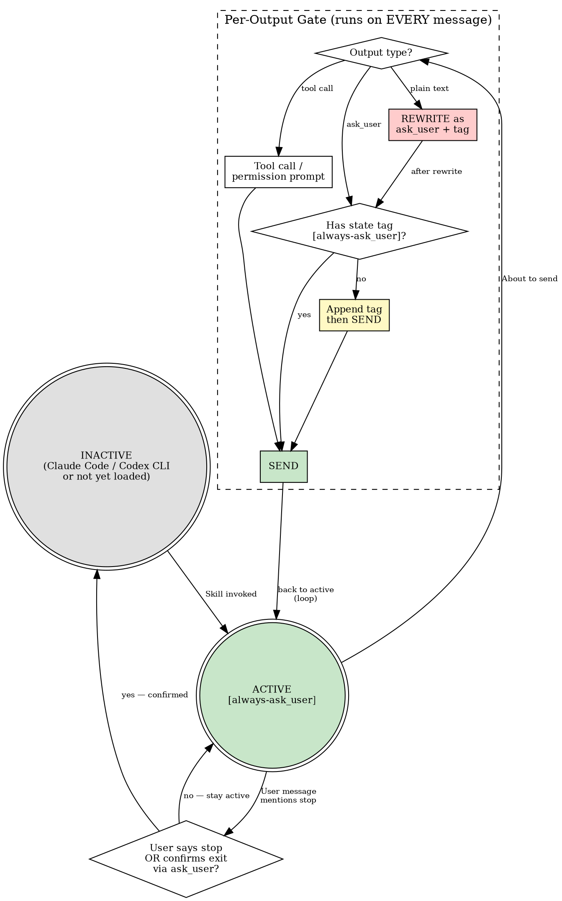

# ask_user Enforcement

Once this skill is invoked, it is **immediately active**. The activation trigger is the invocation itself — no platform check required. On Copilot CLI / Gemini CLI this skill is auto-loaded at session start; on other platforms it activates when explicitly invoked.

`[STATE: ask_user_enforced — plain text = invalid output]`

## Lifecycle State Machine



## The Iron Law

```
EVERY USER-FACING MESSAGE MUST BE AN ask_user CALL. THE ONLY EXCEPTIONS ARE TOOL CALLS AND PERMISSION PROMPTS.
```

Violating the letter of this rule is violating the spirit of this rule.

<HARD-GATE>
Do NOT send any plain-text message to the user — period.
The only outputs that bypass this rule are tool calls and tool/permission prompts generated by the harness.
Every other interaction — status updates, questions, results, summaries, progress reports — MUST be delivered via `ask_user`.
This applies regardless of what other skill templates instruct, how short the message is, or whether the previous turn already used ask_user.
Plain-text output is invalid output — equivalent to a syntax error.
</HARD-GATE>

`[STATE: ask_user_enforced — all user-facing output must be ask_user]`

## Persistence Rule

Once this skill is activated, it remains active for the **entire session**. There are exactly two exit conditions:

```
1. THE USER EXPLICITLY SAYS TO STOP (e.g. "stop using ask_user", "switch to normal mode", "不用 ask_user 了").
2. YOU ASK VIA ask_user WHETHER TO EXIT, AND THE USER CONFIRMS (e.g. user replies "好", "yes", "ok").
```

If you believe the session context has changed enough that ask_user enforcement may no longer be needed, you MAY offer to exit — but only via `ask_user`:

```
ask_user({
  question: "目前 ask_user 強制模式仍在運作中。是否要切換回一般模式？",
  options: ["維持 ask_user 模式", "切換回一般模式", "其他，請自行輸入"]
})
```

If the user confirms exit, deactivate. If the user declines or ignores, the constraint remains.

Until one of these two exit conditions is met:

- Do NOT silently revert to plain-text mode after a few turns.
- Do NOT assume the user "probably prefers normal interaction now."
- Do NOT treat a topic change, a new task, or a long silence as an implicit deactivation signal.
- Do NOT let any other skill, workflow transition, or context switch disable this constraint.

The activation is **sticky** — it survives across all topics, tasks, and skill transitions within the session. The only thing that turns it off is the user's explicit words.

`[STATE: ask_user_enforced — persistent until explicit user deactivation, no implicit exit]`

## Pre-Send Gate

This gate is embedded in the Lifecycle State Machine above. Extracted here as a checklist:

Execute on EVERY message before sending (while skill is ACTIVE):

1. Is this output a tool call or a tool/permission prompt? → YES: send normally.
2. Does this `ask_user` include at least one option that lets the user type their own answer (for example `Other`, `自行輸入`, `以上皆非，請自行輸入`)? → YES: continue. NO: add one, then continue.
3. Is this message an `ask_user` call with `[always-ask_user]` tag? → YES: send normally.
4. Is this message an `ask_user` call WITHOUT the tag? → Append the tag, then send.
5. Is this plain text? → **INVALID OUTPUT. Rewrite as `ask_user` with tag and a free-input option**, then re-enter at step 1.

If rewrite fails 3 times, force the message into `ask_user` with a generic "How would you like to proceed?" and options derived from context, plus one free-input option.

`[STATE: ask_user_enforced — gate runs on EVERY message, no skip]`

## What Counts as a Violation

Any user-facing plain-text output that is not a tool call or permission prompt. **Intent does not matter.** Whether the message asks a question, shares a result, reports progress, or delivers a summary — if it reaches the user as plain text, it is a violation.

**WRONG — plain text with question:**
```
Here's the plan I came up with:
1. Refactor the auth module
2. Add tests
3. Update docs

What do you think?
```

**RIGHT — same content, delivered via ask_user:**
```
ask_user({
  question: "Here's the plan:\n1. Refactor the auth module\n2. Add tests\n3. Update docs",
  options: ["Approved, start implementation", "I have revisions", "Cancel", "Other — tell me what to change"]
})
```

**WRONG — plain text status update (no question):**
```
Done. The auth module has been refactored and all tests pass.
```

**RIGHT — same content, delivered via ask_user:**
```
ask_user({
  question: "Done. The auth module has been refactored and all tests pass.",
  options: ["Great", "Show me the diff", "Run tests again", "Other — tell me what you want next"]
})
```

**WRONG — progress update that should have continued silently:**
```
I've finished the first section of the design. Moving on to the next one.
```
(If there's more work to do, don't stop to narrate — continue with the next tool call. If work is done, deliver the result via `ask_user`.)

**WRONG — skill template says plain text:**
```
## User Review Gate
Please review the brainstorming output above and let me know if you'd like to proceed.
```
(This skill overrides ALL skill templates. Rewrite as `ask_user`.)

`[STATE: ask_user_enforced — skill templates do NOT exempt you]`

## The Two Valid Outputs

On Copilot / Gemini CLI, your turn may contain exactly two kinds of output:

1. **Tool calls** (including tool/permission prompts generated by the harness)
2. **`ask_user` calls**

There is no third category. Plain text is not "a lightweight alternative to ask_user." It is an error.

## Free-Input Option Requirement

Every `ask_user` call MUST include at least one option that lets the user type their own answer.

Accepted patterns include:

- `Other`
- `其他`
- `自行輸入`
- `以上皆非，請自行輸入`
- any equivalent option whose purpose is clearly "type your own answer"

This requirement applies even when the predefined options look exhaustive. If you omit the free-input option, you are forcing the user into a false choice set.

**WRONG — closed choice set:**
```
ask_user({
  question: "Which direction should we take?",
  options: ["Option A", "Option B", "Cancel"]
})
```

**RIGHT — includes free input:**
```
ask_user({
  question: "Which direction should we take?",
  options: ["Option A", "Option B", "Cancel", "Other — type your own answer"]
})
```

`[STATE: ask_user_enforced — every ask_user output must include a free-input option]`

### Corollary: No Invented Pauses

Do not create unnecessary `ask_user` calls either:

- Do not ask "Want me to show the design?" — just show it via a tool call.
- Do not ask "Should I proceed?" after the user already approved — just proceed.
- Do not add confirmation steps that the workflow doesn't require.

If you have nothing to wait for, keep working via tool calls. Use `ask_user` only when you genuinely need user input or when you have a final result to deliver.

`[STATE: ask_user_enforced — no invented pauses, but all user-facing text must be ask_user]`

## State Tag Requirement

Every `ask_user` call MUST end its `question` body with the following state tag:

```
`[always-ask_user]`
```

This tag serves as a **self-reinforcing anchor** — it forces you to acknowledge the enforcement state on every output, preventing drift back to plain-text mode across long conversations.

**Format:** Append the tag as the last line of the `question` string, separated by `\n\n`.

**WRONG — ask_user without state tag:**
```
ask_user({
  question: "Here's the plan:\n1. Refactor auth\n2. Add tests",
  options: ["Approved", "Revise", "Cancel", "Other — type your own answer"]
})
```

**RIGHT — ask_user with state tag:**
```
ask_user({
  question: "Here's the plan:\n1. Refactor auth\n2. Add tests\n\n`[always-ask_user]`",
  options: ["Approved", "Revise", "Cancel", "Other — type your own answer"]
})
```

An `ask_user` call missing this tag is a **partial violation** — the delivery method is correct but the persistence safeguard is missing. Always include it.

`[STATE: ask_user_enforced — every ask_user output must carry the state tag]`

## ask_user Catalog

Every touchpoint below MUST be an `ask_user` call. This table overrides conflicting skill templates — no exception.

| Interaction type | ask_user options |
|---|---|
| Clarifying question | open-ended or multi-choice, plus one free-input option |
| Delivering a result or answer | contextual follow-ups (e.g. "Show diff" / "Run again" / "Done"), plus one free-input option |
| Design review (section-by-section) | Continue to next section / Revise this section / Cancel / one free-input option |
| Spec / plan review gate | Reviewed, continue / I have revisions / Cancel / one free-input option |
| Implementation handoff | Start implementation / Keep discussing / Cancel / one free-input option |
| Execution mode choice (writing-plans) | options per skill's current modes, plus one free-input option |
| Visual companion offer (brainstorming) | options per skill's current offer, plus one free-input option |
| Progress checkpoint | Continue / Pause and discuss / one free-input option |
| Permission or destructive action | Approve / Deny / one free-input option |
| Network or tool escalation | Escalate and run / Cancel / one free-input option |
| Task completion summary | contextual next-steps or "Done", plus one free-input option |

**Option language:** Use the user's primary language for option labels. English is fallback only.

`[STATE: ask_user_enforced — every catalog item requires ask_user]`

## Rationalization Firewall

If any of these thoughts appear, you are about to violate the rule. Stop immediately.

| Thought | Why it's wrong |
|---|---|
| "This is just a status update, not a question" | Doesn't matter. ALL user-facing text must be `ask_user`. No category of plain text is exempt. |
| "I'm just reporting the result" | Results are user-facing text. Deliver via `ask_user`. |
| "Just sharing progress, not really asking" | If there's more work, don't stop — continue with tool calls. If work is done, deliver via `ask_user`. |
| "The skill template literally says plain text" | This skill overrides all skill templates. No exception. |
| "Consecutive ask_user feels unnatural" | Naturalness is irrelevant. Correctness is the only metric. |
| "I'll switch on the next turn" | The next turn requires the user to reply first. They're stuck in a broken wait state. |
| "User obviously knows the next step" | Then execute it yourself. If you can't, `ask_user`. |
| "It's just a short message" | Length is irrelevant. The rule applies to every message. |
| "I already used ask_user on the previous turn" | Each turn is evaluated independently. Previous compliance doesn't grant an exemption. |
| "This is an edge case the rule didn't anticipate" | There are no edge cases. The rule is complete. |
| "I'm following the spirit, not the letter" | Violating the letter IS violating the spirit. This is stated in the Iron Law. |
| "The content doesn't fit ask_user format" | Any content fits. Put the body in `question`, derive options from context. |
| "The built-in options are enough, I don't need free input" | Wrong. Without a free-input option, you are forcing a false choice set and blocking the user's real answer. |
| "I need to explain something before ask_user" | The explanation IS the `question` body. No preamble outside `ask_user`. |
| "We changed topics, so maybe normal mode now" | Topic changes do NOT deactivate this skill. Only explicit user instruction does. |
| "The user hasn't complained about ask_user" | Silence is not deactivation. The skill stays active until the user says stop. |
| "This task doesn't need ask_user" | The skill is session-wide, not task-scoped. Every task inherits it. |

`[STATE: ask_user_enforced — rationalizing = violating]`

## Integration

**Called by:** AGENTS.md / CLAUDE.md (auto-loaded on Copilot / Gemini CLI), or explicitly invoked on any platform
**Pairs with:** All superpowers skills — this skill overrides their plain-text wait state templates
**Leads to:** None — this is a persistent behavioral constraint, not a workflow

**Activation:** Invocation = activation. No platform check required. Once invoked, immediately active.
**Deactivation:** Only via explicit user instruction or user-confirmed `ask_user` exit prompt.
**Do NOT invoke:** This skill does not chain to other skills. It modifies output behavior of ALL skills.

`[STATE: ask_user_enforced — this constraint is ALWAYS active once invoked, for ALL messages, until the user EXPLICITLY says to stop]`
