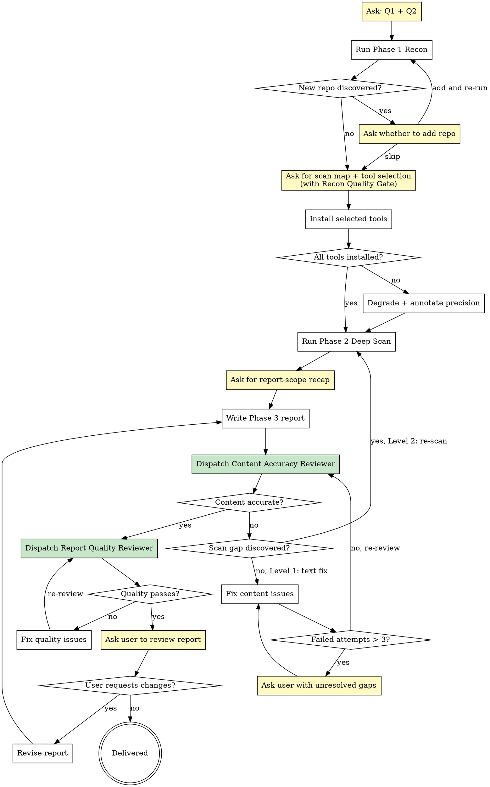
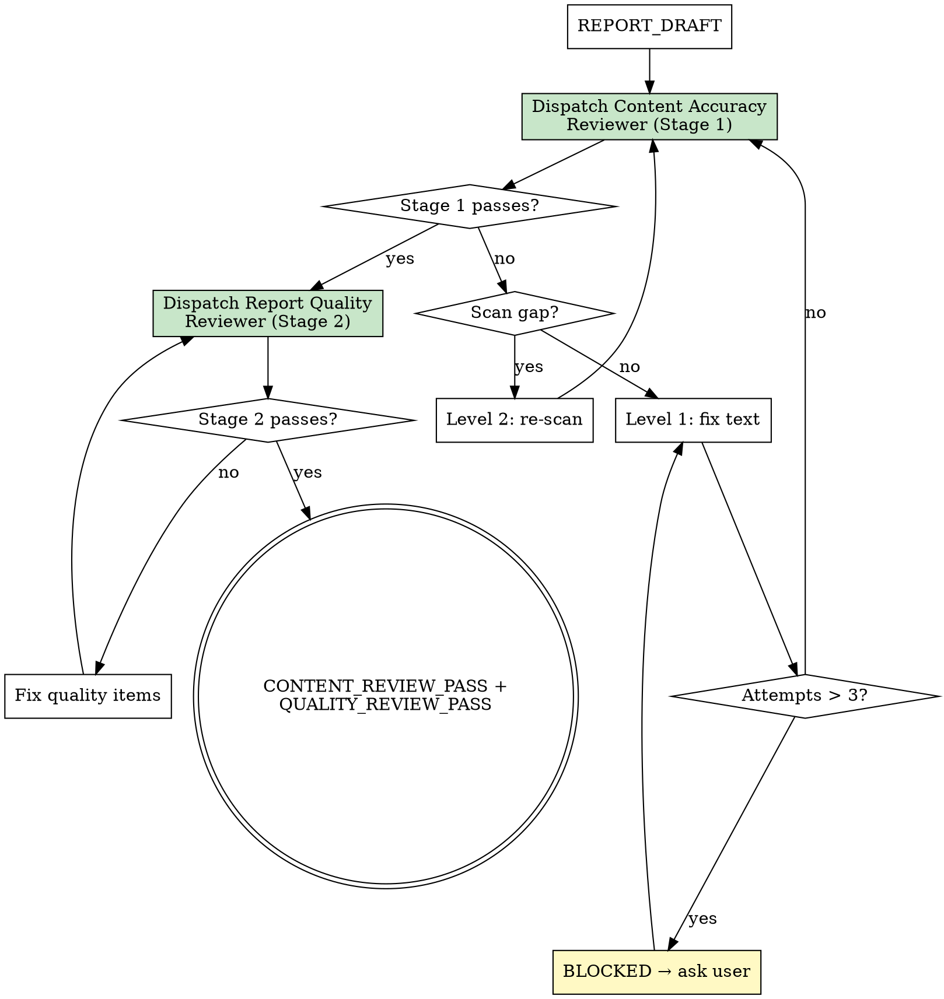

# Architecture Analyzer

掃描多個 repo 的實際程式碼，產出 junior 工程師也能讀懂的系統架構報告。先用 `graphify` 做 Recon 降低漏掃，再用 Deep Scan 把每個 claim 壓到 `file:line`。

每個 checkpoint 都用 ask tool（`AskUserQuestion` / `ask_user`），不要用 plain text 讓使用者卡在 wait state。

## The Iron Law

```
NO CLAIM WITHOUT SOURCE.
NO DELIVERY WITHOUT A PASSING SELF-REVIEW.
```

Violating the letter of this rule is violating the spirit of this rule. 少一個 `file:line`、少一輪 review，整體 quality 就已經失真。

<HARD-GATE>
Do NOT start Recon until Q1 and Q2 are answered.
Do NOT present the report until the draft passes both Stage 1 (Content Accuracy Review) and Stage 2 (Report Quality Review).
This applies even if the system looks small, the user wants a quick summary, or existing docs seem complete.
</HARD-GATE>

## When to Use

在這些情境啟用：

- 新接手陌生的 multi-repo 系統，需要先建立 current architecture reference
- 準備 migration / refactor，需要先盤清跨 repo data flow、coupling points、dead code candidates
- 使用者明確要求做 architecture audit、codebase analysis、cross-repo tracing
- 需要把「功能到底在哪裡、怎麼串起來、哪些是沒接完」寫成可引用的報告

**Not for:**

- 單一路徑的 bug root cause tracing
- runtime performance profiling、production metrics 分析
- system context 已經清楚，只差 implementation plan 的情境

---

## Part A: Scan Process

### Checklist

Create a TodoWrite task for each item. Complete them in order:

1. **Detect graphify** — 確認 `graphify` skill 是否可用
2. **Ask Q1 and Q2** — 確認 Recon 方式與掃描範圍
3. **Run Recon** — 產出 scan map、coupling candidates、dead code candidates
4. **Ask for scan-map confirmation（含 Recon Quality Gate）** — 確認 scan map 與工具組合，同時附上 graphify 限制影響評估
5. **Install selected tools** — 安裝選定的分析工具；安裝失敗時 degrade + annotate precision
6. **Run Deep Scan** — 逐區域追 `file:line` 與 reachability / completeness
7. **Ask for report-scope recap confirmation** — recap 要寫進報告的 repo / 資料夾範圍，再確認是否進入寫報告階段
8. **Write the report** — 依 `templates/report.md` 填入內容
9. **Dispatch Content Accuracy Reviewer** — 用 `reviewers/content-accuracy-reviewer.md` 派發獨立 reviewer subagent 驗證內容正確性
10. **Dispatch Report Quality Reviewer** — Content Accuracy Review 通過後，用 `reviewers/report-quality-reviewer.md` 派發獨立 reviewer subagent 驗證報告品質
11. **Ask the user to review the report** — 收最後一輪修正
12. **Deliver or revise** — 交付，或依 fail level 回到對應階段修正

### Process



黃色節點 = ask tool（`AskUserQuestion` / `ask_user`）。綠色節點 = 獨立 reviewer subagent dispatch。

### Pre-Scan Questions

開始前用 ask tool 一次收完：

**Q1 — Recon 方式**

先偵測 `graphify` skill 是否可用，再問。

graphify 已安裝時的選項：

- 用 graphify Recon（推薦：自動偵測跨 repo coupling 與 dead code candidates）
- 跳過 Recon，直接手動掃

graphify 未安裝時的選項：

- 先安裝 graphify 再開始
- 跳過 Recon，直接手動掃（報告標注漏掃風險）

**Q2 — 掃描範圍**

- **全系統**：所有 repo（當前 working directory + `--add-dir` 路徑）。Recon 每個 repo 都跑 graphify，Deep Scan 逐區域全掃。
- **特定功能**：使用者指定功能名（如「頁面編輯器」「結帳流程」）。Recon 所有 repo 都跑 graphify，但只留相關 community。Deep Scan 只掃相關區域，跨 repo 耦合仍追。選此項時追問功能名稱。

### Phase 1: Recon

**用 graphify 時：**

1. 對每個 repo 跑 `/graphify <path> --mode deep --no-viz`
2. 讀每個 repo 的 `graphify-out/GRAPH_REPORT.md`
3. 提取三類資訊：
   - **Community detection** -> 掃描區域。Q2 選「特定功能」時只留相關 community
   - **Cross-document connections** -> 跨 repo coupling candidates。指向不在清單的 repo 時，要 ask 是否加入
   - **Isolated nodes** -> dead code candidates
4. 產出 scan map：區域 + coupling candidates + dead code candidates
5. 迴圈處理：發現新 repo -> ask -> 加入 -> 重跑 Recon -> 合併結果。直到沒有新 repo

**graphify 已知限制**（Recon 結果要帶著限制讀）：

- JS/TS cross-file 解析是 file-level，不是 entity-level
- 不理解 monorepo workspace 結構
- 邊 weight 一律 1.0，clustering 偏結構性分群
- 沒有 git co-change

Recon 產出的是 coarse map；Phase 2 才做 verification。

**Artifact 存放**：集中到報告所在 repo 的 `.graphify-cache/`（加入 `.gitignore`），按 repo alias 分 subdirectory：

```text
.graphify-cache/
├── @{alias-1}/
│   ├── graph.json
│   └── GRAPH_REPORT.md
└── @{alias-2}/
    └── ...
```

**Naming rules**：

- subdirectory 名稱一律使用 repo alias，格式固定為 lowercase kebab-case ASCII，例如 `admin`、`meep-nx`、`meepshop-api`
- cache 檔名固定為 `graph.json` 與 `GRAPH_REPORT.md`，不要自創變體
- 同一個 repo 重跑時直接覆蓋原檔，不要加 timestamp、亂數 suffix 或 `-v2`

留著可用 `--update` 增量更新，不需要時可刪。

**跳過 graphify 時：**

1. 目錄 structure 檢查（`ls` + glob 找入口檔案）
2. 手動列掃描區域
3. `grep` import / require 找跨 repo 耦合
4. 產出 scan map（更 coarse，漏掃風險更高）

### Recon Quality Gate

scan-map confirmation 時，必須附上 graphify 限制影響評估，讓使用者做 informed consent 而非 rubber-stamp：

| 限制 | 可能遺漏的區域 | 建議在 Deep Scan 補充的手段 |
| --- | --- | --- |
| JS/TS cross-file 解析是 file-level | entity-level coupling（function / class 層級的跨檔依賴） | `ts-morph` 追 entity-level |
| 不理解 monorepo workspace 結構 | workspace boundary 誤判（同 repo 不同 workspace 被視為同一 community） | `nx graph` / `knip` 補 workspace boundary |
| edge weight 一律 1.0 | clustering 偏結構性，高頻互動的模組可能被拆開 | 手動審視 community 劃分合理性 |
| 沒有 git co-change | 歷史耦合遺漏（經常一起改但沒有 import 關係的檔案） | `git log --follow` 抽查 |

### Tool Selection (Phase 1 -> 2)

Recon 完成後、Deep Scan 開始前，根據 codebase 特徵偵測可用工具，組成推薦方案用 ask tool 提交使用者。

| 偵測條件 | 推薦工具 | 理由 |
| --- | --- | --- |
| 有 `tsconfig.json` 或 `.ts` 檔 | `madge` | graphify 對 JS/TS 只有 file-level import，`madge` 能畫完整 dependency graph |
| 有 `tsconfig.json` + entity-level 需求 | `ts-morph` | 能追到 function / class / type level |
| 有 `nx.json` 或 `project.json` | `nx graph` | 理解 Nx workspace boundary |
| 有 `package.json` workspaces 或 `lerna.json` | `knip` | dead code 偵測比 `grep` 精確，理解 monorepo export chain |

ask 時列出偵測結果、推薦理由、安裝狀態，讓使用者選：

- 全部安裝 + 使用（推薦）
- 只用已安裝的
- 只用 graphify + `grep`（最輕量）
- 自選組合

未安裝的工具要問要不要裝。不裝就跳過，但報告必須標注精度限制。

### Tool Installation Failure Path

如果使用者同意安裝但安裝失敗：

1. **記錄失敗的工具和錯誤訊息**
2. **降級到不需要該工具的方案**，對照上方偵測條件表選替代
3. **在報告的 Precision Annotation 中標注**：`⚠ {tool} 安裝失敗，以下結論依賴 {fallback}，精度受限`
4. 如果所有推薦工具都安裝失敗，回退到 `graphify + grep` 最輕量方案

降級後 **不能** 省略受影響區域的掃描，只能標注精度較低。

### Phase 2: Deep Scan

按 scan map 逐區域掃。每個 claim 記 `file:line`。使用前一步選定的工具輔助。

狀態判定用兩層模型：

- **Layer A（Reachability）**：`reachable` / `unused` / `needs review`
- **Layer B（Completeness）**：`complete` / `incomplete` / `missing`

對每個想標 `reachable` 的項目，至少補一個關鍵 action check：

- button / form：有沒有 `onClick` / `onSubmit`
- editor / manager：有沒有 mutation、save flow
- route page：有沒有 export 到 production router
- package：有沒有被 production dependency + route chain 使用

reachability chain 成立但關鍵 action 缺失時，拆成相鄰兩段呈現，不合併成一句。

#### Absence Verification Protocol

標 `unused` 前，必須做 consumer absence check：

1. grep package name（如 `@store/group`）in all repo `package.json` dependencies
2. grep import statement in all source files（排除 node_modules / lib / dist）
3. 兩項都零 match，才能標 `unused`。只做其中一項不夠

標 `incomplete` 前，必須窮舉否定所有可能的觸發機制：

1. 直接 handler（onClick、onSubmit、onChange）
2. Context injection（useContext、Provider）
3. Keyboard shortcut（keydown、keypress、Ctrl+S / Cmd+S）
4. Parent component injection（props callback）
5. Global event listener（addEventListener）
6. Mutation / API call（useMutation、fetch、postGraphql）

全部搜不到反面證據，才能標 `incomplete`。「可能透過 X 觸發」不能跳過驗證 X 的不存在。

#### Multi-Entry Path Tracing

對 rendering pipeline，必須從所有 page entry（`pages/*.js` 或等效 route entry）各自追到最終渲染元件：

1. 列出所有 `pages/` 下的 entry file
2. 每個 entry 獨立追 import chain 到最終 component lookup / render
3. 合併路徑：相同路徑歸為同一 pipeline，不同路徑標為多 pipeline
4. 發現多 pipeline 時，必須在報告中標明每個 page entry 走哪條 pipeline

只從單一入口追到一條路徑就停，是常見的漏掃來源。

Deep Scan 完成後，先整理一份 report-scope recap，再用 ask tool 確認。至少包含：

- 要寫進報告的 repo 清單
- 每個 repo 要寫進報告的資料夾 / workspace 範圍
- 明確排除不寫的 repo / 資料夾
- 仍需標 `needs review` 的區域

沒做這個 recap，不准進 `Write the Report`。

### Phase 3: Write the Report

使用 `templates/report.md` 骨架，填入掃描結果。草稿完成後立刻進入 Two-Stage Subagent Review，不要先交付。

### Status Codes

| Code | 意義 | 下一步 |
| --- | --- | --- |
| `RECON_DONE` | Recon 完成，scan map 已產出 | ask 確認 scan map + 工具選型（含 Recon Quality Gate） |
| `TOOLS_DEGRADED` | 部分工具安裝失敗，已降級 | 繼續 Deep Scan，但報告標注 precision annotation |
| `SCAN_DONE` | Deep Scan 完成 | ask 確認要寫進報告的 repo / 資料夾範圍 |
| `REPORT_DRAFT` | 報告草稿完成 | Dispatch Content Accuracy Reviewer |
| `CONTENT_REVIEW_PASS` | 內容正確性 Review 通過 | Dispatch Report Quality Reviewer |
| `CONTENT_REVIEW_FAIL` | 內容正確性 Review 未通過 | 依 rollback level 修正後重新 dispatch reviewer |
| `QUALITY_REVIEW_PASS` | 報告品質 Review 通過 | ask 使用者 review |
| `QUALITY_REVIEW_FAIL` | 報告品質 Review 未通過 | 修 failing items，重新 dispatch quality reviewer |
| `BLOCKED` | 3 次 review 仍未通過，或缺少必要使用者決策 | ask 使用者補方向或解除 blocker |
| `DELIVERED` | 使用者確認交付 | 完成 |

---

## Part B: Report Guidelines

### Report Rules

1. **沒有 code 就不能寫** — 每個 claim 要有 `[source-of-truth:N]`
2. **Reachability / Completeness 分離** — 先追 reachability，再查 completeness；兩層不混寫
3. **掃完所有 repo 才能下結論**
4. **Production code > 文件** — 當術語、狀態或行為在 production code 和 project docs（README、planning docs）有衝突時，以 production code 為準。文件描述預期狀態，code 描述實際狀態
4. **不用行話** — 術語定義一次，junior 看不懂就換掉
5. **替人類切塊** — 每段約 20 行上限
6. **結論先行** — 先寫結論再給 source，不是先堆 context
7. **一個概念一個詞** — 在 Glossary 對齊後全文統一
8. **alias 定義後全文用 alias** — Repo Reference 定義 `@repo` 後不再回退到全名
9. **不重複** — 一個事實只在一個章節解釋，其他地方用 cross-reference
10. **圖表一律 mermaid** — 超過 50 節點可用 PlantUML，禁止 ASCII art
11. **表格放 mapping，解釋放外面** — 結構化資訊進表格，長解釋放表格外
12. **為人類的認知負荷而寫** — 每段只講一件事，新概念一出現就定義
13. **輕快好讀** — 能一句講完就不要兩句
14. **線性邏輯** — 後面的章節只引用前面已出現的概念
15. **本機文件一律用可點擊連結** — 只要引用本機 doc / report / spec，就必須寫成 markdown file link，不准只貼裸路徑
16. **最終報告禁止註記輸出** — 禁止保留 ` ```hint `、`模板註記`、作者備忘或任何只給寫作者看的提示

### Status Model

#### Layer A: Reachability

適用單位：workspace / route / package / production entry

| 狀態 | 定義 |
| --- | --- |
| `reachable` | production flow 可達，有 route / menu link / import chain 證據 |
| `unused` | 沒找到 consumer / route / import chain |
| `needs review` | 已窮舉靜態分析手段但仍無法判定。「可能透過 X 觸發」不能直接標 `needs review`，必須先驗證 X 不存在 |

#### Layer B: Completeness

適用單位：button / tab / handler / mutation flow / save flow / control

| 狀態 | 定義 |
| --- | --- |
| `complete` | 關鍵 user action 已接到完整 handler / flow |
| `incomplete` | 可見或可達，但關鍵 action 未完整接通 |
| `missing` | 關鍵 control 或 handler 缺席 |

**判定規則**：

1. 先判 reachability，再判 completeness。一個 claim 一次只講一層
2. 若 workspace 可達但內部 action 不完整，拆成相鄰兩段，不合併
3. 正確輸出：`Workspace status: reachable` + `Control status: incomplete`

### Citation Format

正文用**短路徑 + `[source-of-truth:N]`**（同一個單元、同一格）。Sources of Truth Index 放完整路徑。

- 短路徑帶 1-2 層父資料夾
- 不能只放 tag，要搭配短路徑或描述
- code block 裡已有完整路徑就不加 tag
- 純展示路徑的 table 欄可用完整路徑，但分析欄仍要用短路徑 + tag
- `[source-of-truth:N]` 和 `[unverified:N]` 分開編號
- 只要引用本機 doc / report / spec，一律用可點擊 markdown file link，例如 [2026-04-13-page-editor-cross-repo-architecture-report.md](/Users/alex/Desktop/meepshop-repo/dnd-explorer/docs/analysis/2026-04-13-page-editor-cross-repo-architecture-report.md:1)

### Report Skeleton

見 `templates/report.md`。固定章節：

1. What This Report Covers
2. Repo Reference
3. Glossary
4. Data Flow（mermaid）
5. Component Inventory
6. Status Summary（`unused` / `needs review` + 相鄰的 `incomplete` controls）
7. Sources of Truth Index（Verified / Unverified）

彈性章節：Cross-Repo Coupling、Component Data Flow（mermaid，超過 50 節點可用 PlantUML）

## Two-Stage Subagent Review

### 核心原則：Builder ≠ Critic

寫報告的 agent 和 review 報告的 agent **必須是不同的 subagent**。這不是形式主義——同一個 agent 既寫又審，會系統性地遺漏自己的盲點（echo chamber problem）。

Review 分為兩個獨立階段，各自由一個 fresh-context reviewer subagent 執行。Stage 1 必須通過後才能進入 Stage 2。

### Stage 1: Content Accuracy Review

取代原有的 Code Verification Review。派發獨立 reviewer subagent，使用 `reviewers/content-accuracy-reviewer.md` 作為 prompt。

**Dispatch 方式**：
```
用 task tool (agent_type: "general-purpose") dispatch reviewer subagent。
Prompt = reviewers/content-accuracy-reviewer.md 的完整內容 + 報告草稿 + scan-map。
Reviewer 有完整 codebase access，但不繼承 builder 的 context / reasoning。
```

**如果 task tool 不可用**（fallback）：由 builder 自己執行 content-accuracy-reviewer.md 中定義的 4 項 checks，但必須在報告中標注 `⚠ self-review fallback, no independent verification`。

**Fail 時的 Rollback Levels**：
- **Level 1（文字問題）**：source-of-truth tag 不正確、描述措辭超出 code 支持範圍 → 回到 Write Phase 修文字，再重新 dispatch reviewer
- **Level 2（掃描遺漏）**：整個區域漏掃、cross-repo chain 斷裂 → 回到 Deep Scan 補掃，再重新寫報告 + dispatch reviewer

**Iteration cap**：同一 stage 最多 3 failed attempts。超過 3 failed attempts 設 `BLOCKED`，列出 unresolved gaps 交給使用者決定。

### Stage 2: Report Quality Review

取代原有的 Review Loop。只在 Stage 1 通過（`CONTENT_REVIEW_PASS`）後才啟動。派發另一個獨立 reviewer subagent，使用 `reviewers/report-quality-reviewer.md` 作為 prompt。

**Dispatch 方式**：
```
用 task tool (agent_type: "general-purpose") dispatch reviewer subagent。
Prompt = reviewers/report-quality-reviewer.md 的完整內容 + 報告草稿。
```

**如果 task tool 不可用**（fallback）：同 Stage 1，由 builder 自己執行 6 項 checks，標注 `⚠ self-review fallback`。

**Fail 時**：修 failing items 後重新 dispatch quality reviewer（不需要重跑 Stage 1，除非修改幅度影響了內容正確性）。

### Review 流程摘要



## Red Flags — STOP and Return to Process

如果你腦中冒出下面任何一句，先停下來，回到流程：

- 「這個系統看起來很小，可以跳過 Recon」
- 「文件已經寫了，不必再看 code」
- 「先寫報告草稿，再補 source 就好」
- 「route 可達，大概就代表功能完整」
- 「先掃一個 repo，其他 repo 之後再說」
- 「Self-Review 很像形式檢查，略過沒差」
- 「Self-Review 就夠了，不需要 dispatch reviewer subagent」
- 「Reviewer subagent 的結論跟我想的一樣，所以 self-review 是等價的」
- 「Stage 1 有幾個小問題但不影響大局，直接進 Stage 2」
- 「使用者趕時間，可以先交一版沒跑完 review 的摘要」
- 「找到一條渲染路徑，其他應該一樣」
- 「可能透過 Context 觸發，標 needs review 就好」

## Rationalization Table

| Excuse | Why it is wrong |
| --- | --- |
| 「這個系統很簡單，不需要完整流程」 | 簡單系統的隱性耦合最容易被低估。看起來只有 3 個 repo，掃完可能發現第 4 個才是真正的 production 入口。 |
| 「code 存在就代表在用」 | 一個 package 可能整個 repo 零 external import；一個 editor 的 save 按鈕也可能根本沒接 `onClick`。存在不代表 reachability。 |
| 「我已經讀過 CLAUDE.md / README 了」 | 文件只能提供預期狀態，不能替代實際 code path。resolver、router、mapping 檔可能早就和文件脫節。 |
| 「掃一個 repo 就夠了」 | 功能常常跨 repo 分散。只掃 monorepo 可能漏掉獨立 repo 或後端組裝層，結論就會偏掉。 |
| 「先寫報告再驗證」 | 未驗證的 claim 一旦進報告，就會被讀者當成事實。補驗證通常比先驗證更慢，還更容易漏。 |
| 「route 可達 = 功能正常」 | route 只證明入口存在，不代表 button、mutation、save flow 已經接通。reachability 和 completeness 是兩個不同層。 |
| 「route 可達 + 按鈕可見 = complete」 | UI 可見不等於 handler 已接。沒有 `onClick` / `onSubmit` / mutation flow，就只能判 `incomplete`。 |
| 「找到一條渲染路徑就夠了」 | 每個 page entry 可能走不同 pipeline。只從單一入口追到一條路徑就停，是最常見的漏掃來源。必須從所有 `pages/*.js` 各自追。 |
| 「可能透過 X 觸發，標 needs review」 | 推測不能替代驗證。先 grep / read 確認 X 不存在，才能在仍有疑慮時標 `needs review`。跳過否定驗證就標 `needs review` 是偷懶，不是謹慎。 |
| 「README 說這個術語是新的」 | 文件描述預期狀態，production code 描述實際狀態。術語可能早就在 DB model、GraphQL、前端 hook 中使用。先 grep production code，再讀文件。 |
| 「Self-review 跟 subagent review 效果一樣」 | 研究顯示同一 context 的 self-review 系統性遺漏 builder 盲點（echo chamber）。Independent reviewer 用 fresh context 驗證，能抓到 builder 看不到的問題。 |
| 「Stage 1 小瑕疵可以跳過直接進 Stage 2」 | Stage 1 驗的是內容正確性——報告說的和 code 實際情況是否一致。內容不正確的報告再怎麼改品質也沒意義。兩個 stage 不能並行或跳過。 |

## Integration

**Called by:** `superpowers:brainstorming`（當掃描範圍、功能邊界或驗收條件不清楚時先釐清；也可直接由 architecture audit / repo onboarding request 觸發。）

**Pairs with:** `graphify`（`REQUIRED` if installed；負責 Recon 粗掃。需要更高精度時，再搭配 `madge` / `ts-morph` / `nx graph` / `knip` 做 Deep Scan。）

**Leads to:** `superpowers:writing-plans`（當 architecture report 已建立後，用來拆 migration / refactor plan；若要把報告再做 graphify，可對報告本身再跑一次 `/graphify`。）

**REQUIRED skills:** `graphify` if installed。若不可用，必須顯式降級為手動 Recon，並在報告中標注漏掃風險與精度限制。

**Do NOT invoke:** `superpowers:writing-plans` before `RECON_DONE`；單一路徑 debugging workflow；任何直接跳到 implementation 的技能，除非 architecture report 已完成。

**Handoff condition:** 當狀態為 `DELIVERED`，且報告已包含 scan map、Reachability / Completeness 雙層狀態與 Sources of Truth Index，才交給後續規劃或重構工作。
