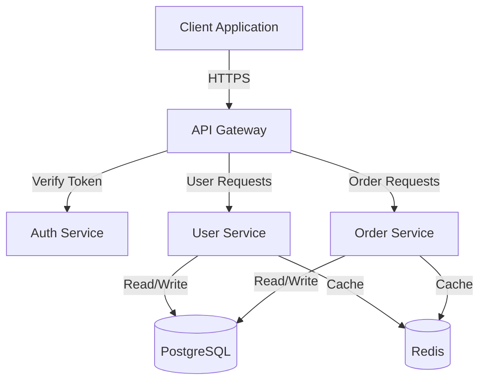
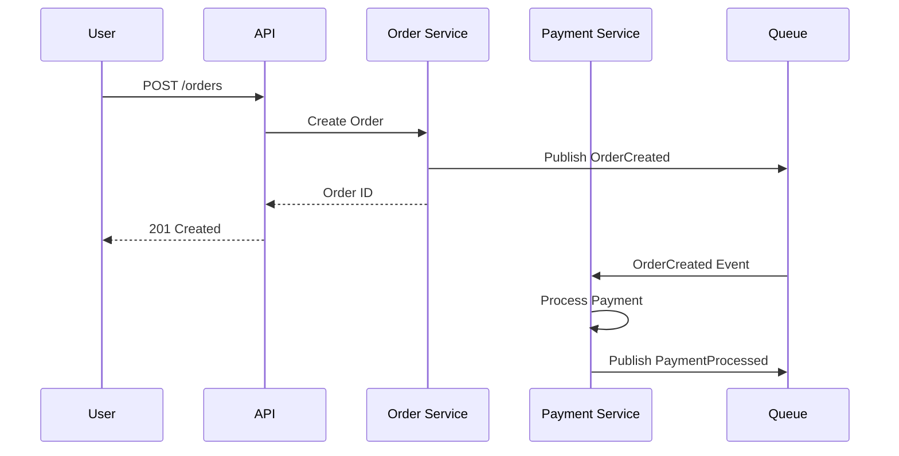

# Awesome Software Design Patterns

> Skill by [ara.so](https://ara.so) — Design Skills collection.

A comprehensive resource for organizing and structuring software through proven design patterns, architecture decision records (ADRs), and automated verification rules. This skill helps you apply battle-tested design principles, document architectural decisions, and enforce design constraints through CI/CD.

## What This Resource Provides

This curated collection covers:

- **Implementation Patterns & Reference Code** - Production-ready examples of DDD, CQRS, Clean Architecture, Event Sourcing
- **Design Patterns** - All 23 GoF patterns plus enterprise and architectural patterns
- **API & Interface Design** - Industry-standard guidelines from Google, Microsoft
- **Decision Records (ADR/RFC)** - Templates and real-world examples for documenting architecture decisions
- **Documentation as Code** - C4 Model, Mermaid, PlantUML, and other diagram-as-code tools
- **Architecture Verification** - CI-integrated tools for enforcing architecture rules (ArchUnit, Arkitect, etc.)
- **Operational Case Studies** - Real-world architecture examples from Figma, Discord, Shopify, Stripe

## Key Design Patterns Reference

### Creational Patterns

**Singleton Pattern** - Ensures a class has only one instance with global access:

```php
// PHP Example
class Database {
    private static ?Database $instance = null;
    private PDO $connection;
    
    private function __construct() {
        $this->connection = new PDO(
            $_ENV['DB_DSN'],
            $_ENV['DB_USER'],
            $_ENV['DB_PASS']
        );
    }
    
    public static function getInstance(): Database {
        if (self::$instance === null) {
            self::$instance = new Database();
        }
        return self::$instance;
    }
    
    public function getConnection(): PDO {
        return $this->connection;
    }
}

// Usage
$db = Database::getInstance();
```

**Factory Pattern** - Creates objects without specifying exact classes:

```go
// Go Example
package notification

type Notification interface {
    Send(message string) error
}

type EmailNotification struct {
    recipient string
}

func (e *EmailNotification) Send(message string) error {
    // Send email implementation
    return nil
}

type SMSNotification struct {
    phoneNumber string
}

func (s *SMSNotification) Send(message string) error {
    // Send SMS implementation
    return nil
}

type NotificationFactory struct{}

func (f *NotificationFactory) Create(notifType, target string) Notification {
    switch notifType {
    case "email":
        return &EmailNotification{recipient: target}
    case "sms":
        return &SMSNotification{phoneNumber: target}
    default:
        return nil
    }
}

// Usage
factory := &NotificationFactory{}
notif := factory.Create("email", "user@example.com")
notif.Send("Hello World")
```

**Builder Pattern** - Constructs complex objects step by step:

```go
// Go Example
package query

type SQLQuery struct {
    table      string
    columns    []string
    where      string
    orderBy    string
    limit      int
}

type QueryBuilder struct {
    query SQLQuery
}

func NewQueryBuilder(table string) *QueryBuilder {
    return &QueryBuilder{
        query: SQLQuery{table: table, columns: []string{"*"}},
    }
}

func (b *QueryBuilder) Select(columns ...string) *QueryBuilder {
    b.query.columns = columns
    return b
}

func (b *QueryBuilder) Where(condition string) *QueryBuilder {
    b.query.where = condition
    return b
}

func (b *QueryBuilder) OrderBy(field string) *QueryBuilder {
    b.query.orderBy = field
    return b
}

func (b *QueryBuilder) Limit(limit int) *QueryBuilder {
    b.query.limit = limit
    return b
}

func (b *QueryBuilder) Build() string {
    sql := "SELECT " + strings.Join(b.query.columns, ", ") + " FROM " + b.query.table
    if b.query.where != "" {
        sql += " WHERE " + b.query.where
    }
    if b.query.orderBy != "" {
        sql += " ORDER BY " + b.query.orderBy
    }
    if b.query.limit > 0 {
        sql += fmt.Sprintf(" LIMIT %d", b.query.limit)
    }
    return sql
}

// Usage
query := NewQueryBuilder("users").
    Select("id", "name", "email").
    Where("age > 18").
    OrderBy("created_at DESC").
    Limit(10).
    Build()
```

### Structural Patterns

**Adapter Pattern** - Makes incompatible interfaces work together:

```php
// PHP Example - Adapting legacy payment gateway to new interface
interface PaymentGateway {
    public function processPayment(float $amount, string $currency): bool;
}

class LegacyPaymentService {
    public function pay(int $amountInCents, string $currencyCode): array {
        // Legacy payment logic
        return ['status' => 'success', 'transaction_id' => 'TXN123'];
    }
}

class PaymentAdapter implements PaymentGateway {
    private LegacyPaymentService $legacyService;
    
    public function __construct(LegacyPaymentService $legacyService) {
        $this->legacyService = $legacyService;
    }
    
    public function processPayment(float $amount, string $currency): bool {
        $amountInCents = (int)($amount * 100);
        $result = $this->legacyService->pay($amountInCents, $currency);
        return $result['status'] === 'success';
    }
}

// Usage
$legacy = new LegacyPaymentService();
$adapter = new PaymentAdapter($legacy);
$success = $adapter->processPayment(99.99, 'USD');
```

**Decorator Pattern** - Adds behavior to objects dynamically:

```go
// Go Example
package middleware

type Handler interface {
    Handle(request string) string
}

type BaseHandler struct{}

func (h *BaseHandler) Handle(request string) string {
    return "Handling: " + request
}

type LoggingDecorator struct {
    handler Handler
}

func (d *LoggingDecorator) Handle(request string) string {
    log.Printf("Before handling: %s", request)
    result := d.handler.Handle(request)
    log.Printf("After handling: %s", result)
    return result
}

type AuthDecorator struct {
    handler Handler
}

func (d *AuthDecorator) Handle(request string) string {
    if !isAuthenticated(request) {
        return "Unauthorized"
    }
    return d.handler.Handle(request)
}

// Usage - Stack decorators
handler := &BaseHandler{}
handler = &LoggingDecorator{handler: handler}
handler = &AuthDecorator{handler: handler}
result := handler.Handle("user-request")
```

### Behavioral Patterns

**Strategy Pattern** - Defines a family of algorithms and makes them interchangeable:

```php
// PHP Example - Different pricing strategies
interface PricingStrategy {
    public function calculate(float $basePrice): float;
}

class RegularPricing implements PricingStrategy {
    public function calculate(float $basePrice): float {
        return $basePrice;
    }
}

class SeasonalDiscount implements PricingStrategy {
    private float $discountPercent;
    
    public function __construct(float $discountPercent) {
        $this->discountPercent = $discountPercent;
    }
    
    public function calculate(float $basePrice): float {
        return $basePrice * (1 - $this->discountPercent / 100);
    }
}

class VIPPricing implements PricingStrategy {
    public function calculate(float $basePrice): float {
        return $basePrice * 0.80; // 20% off
    }
}

class Product {
    private float $basePrice;
    private PricingStrategy $pricingStrategy;
    
    public function __construct(float $basePrice, PricingStrategy $strategy) {
        $this->basePrice = $basePrice;
        $this->pricingStrategy = $strategy;
    }
    
    public function setStrategy(PricingStrategy $strategy): void {
        $this->pricingStrategy = $strategy;
    }
    
    public function getPrice(): float {
        return $this->pricingStrategy->calculate($this->basePrice);
    }
}

// Usage
$product = new Product(100, new RegularPricing());
echo $product->getPrice(); // 100

$product->setStrategy(new SeasonalDiscount(15));
echo $product->getPrice(); // 85

$product->setStrategy(new VIPPricing());
echo $product->getPrice(); // 80
```

**Observer Pattern** - Defines subscription mechanism to notify multiple objects:

```go
// Go Example - Event system
package events

type Event struct {
    Name string
    Data interface{}
}

type Observer interface {
    Update(event Event)
}

type Subject struct {
    observers []Observer
}

func (s *Subject) Attach(observer Observer) {
    s.observers = append(s.observers, observer)
}

func (s *Subject) Detach(observer Observer) {
    for i, obs := range s.observers {
        if obs == observer {
            s.observers = append(s.observers[:i], s.observers[i+1:]...)
            break
        }
    }
}

func (s *Subject) Notify(event Event) {
    for _, observer := range s.observers {
        observer.Update(event)
    }
}

// Concrete observers
type EmailNotifier struct{}

func (e *EmailNotifier) Update(event Event) {
    log.Printf("Email notification for event: %s", event.Name)
}

type LogObserver struct{}

func (l *LogObserver) Update(event Event) {
    log.Printf("Logging event: %s with data: %v", event.Name, event.Data)
}

// Usage
subject := &Subject{}
subject.Attach(&EmailNotifier{})
subject.Attach(&LogObserver{})

subject.Notify(Event{
    Name: "UserRegistered",
    Data: map[string]string{"email": "user@example.com"},
})
```

## Implementing Clean Architecture

### Layered Structure

```
project/
├── domain/          # Business logic, entities, domain events
├── application/     # Use cases, application services
├── infrastructure/  # External dependencies (DB, API, queue)
└── interfaces/      # Controllers, CLI, API handlers
```

### Go Example with Clean Architecture

```go
// domain/user.go - Core business entity
package domain

import "errors"

type User struct {
    ID       string
    Email    string
    Password string
    Active   bool
}

func NewUser(email, password string) (*User, error) {
    if email == "" {
        return nil, errors.New("email required")
    }
    if len(password) < 8 {
        return nil, errors.New("password must be at least 8 characters")
    }
    return &User{
        Email:    email,
        Password: password,
        Active:   true,
    }, nil
}

type UserRepository interface {
    Save(user *User) error
    FindByEmail(email string) (*User, error)
}

// application/register_user.go - Use case
package application

import "project/domain"

type RegisterUserUseCase struct {
    repo domain.UserRepository
}

func NewRegisterUserUseCase(repo domain.UserRepository) *RegisterUserUseCase {
    return &RegisterUserUseCase{repo: repo}
}

func (uc *RegisterUserUseCase) Execute(email, password string) error {
    // Check if user exists
    existing, _ := uc.repo.FindByEmail(email)
    if existing != nil {
        return errors.New("user already exists")
    }
    
    // Create new user
    user, err := domain.NewUser(email, password)
    if err != nil {
        return err
    }
    
    // Save user
    return uc.repo.Save(user)
}

// infrastructure/postgres_user_repository.go - Implementation
package infrastructure

import (
    "database/sql"
    "project/domain"
)

type PostgresUserRepository struct {
    db *sql.DB
}

func NewPostgresUserRepository(db *sql.DB) *PostgresUserRepository {
    return &PostgresUserRepository{db: db}
}

func (r *PostgresUserRepository) Save(user *domain.User) error {
    _, err := r.db.Exec(
        "INSERT INTO users (email, password, active) VALUES ($1, $2, $3)",
        user.Email, user.Password, user.Active,
    )
    return err
}

func (r *PostgresUserRepository) FindByEmail(email string) (*domain.User, error) {
    user := &domain.User{}
    err := r.db.QueryRow(
        "SELECT id, email, password, active FROM users WHERE email = $1",
        email,
    ).Scan(&user.ID, &user.Email, &user.Password, &user.Active)
    
    if err == sql.ErrNoRows {
        return nil, nil
    }
    return user, err
}

// interfaces/http/handler.go - API layer
package http

import (
    "encoding/json"
    "net/http"
    "project/application"
)

type RegisterRequest struct {
    Email    string `json:"email"`
    Password string `json:"password"`
}

type UserHandler struct {
    registerUseCase *application.RegisterUserUseCase
}

func NewUserHandler(registerUseCase *application.RegisterUserUseCase) *UserHandler {
    return &UserHandler{registerUseCase: registerUseCase}
}

func (h *UserHandler) Register(w http.ResponseWriter, r *http.Request) {
    var req RegisterRequest
    if err := json.NewDecoder(r.Body).Decode(&req); err != nil {
        http.Error(w, err.Error(), http.StatusBadRequest)
        return
    }
    
    err := h.registerUseCase.Execute(req.Email, req.Password)
    if err != nil {
        http.Error(w, err.Error(), http.StatusBadRequest)
        return
    }
    
    w.WriteHeader(http.StatusCreated)
    json.NewEncoder(w).Encode(map[string]string{"status": "success"})
}
```

## Architecture Decision Records (ADR)

### Basic ADR Template (MADR Format)

Create `docs/adr/0001-use-postgresql-for-primary-database.md`:

```markdown
# 1. Use PostgreSQL for Primary Database

Date: 2024-01-15

## Status

Accepted

## Context

We need to choose a primary database for our application that will store user data, 
transactions, and business entities. Requirements:
- ACID transactions
- Complex queries with JOINs
- Strong consistency
- Open source with good community support
- Performance for 10M+ records

## Decision

We will use PostgreSQL 15+ as our primary relational database.

## Consequences

### Positive
- Strong ACID guarantees for financial data
- Excellent JSON support for flexible schemas
- Rich ecosystem of tools (PgBouncer, pg_stat_statements, pgAdmin)
- Built-in full-text search capabilities
- Easy horizontal read scaling with replicas

### Negative
- More complex to scale writes compared to NoSQL solutions
- Requires careful index management for query performance
- Backup/restore operations need planning at scale
- Vertical scaling limits eventual

### Neutral
- Team needs to maintain PostgreSQL expertise
- Will use managed service (AWS RDS) to reduce operational burden
```

### CLI Tools for Managing ADRs

```bash
# Install adr-tools
brew install adr-tools  # macOS
apt-get install adr-tools  # Ubuntu

# Initialize ADR directory
adr init docs/architecture/decisions

# Create new ADR
adr new "Use event sourcing for order management"

# Link ADRs
adr new -l "2:Amends:partial replacement" "Use CQRS with event sourcing"

# Generate table of contents
adr generate toc > docs/architecture/decisions/README.md
```

### Using log4brains for ADR Management

```bash
# Install log4brains
npm install -g log4brains

# Initialize in project
log4brains init

# Create new ADR interactively
log4brains adr new

# Preview documentation site
log4brains preview

# Build static site
log4brains build
```

Configuration `.log4brains.yml`:

```yaml
project:
  name: "My Project"
  tz: "America/New_York"

adr:
  defaultStatus: "proposed"
  defaultTemplate: "madr"
  
output:
  path: "dist"
```

## Documentation as Code

### C4 Model with Structurizr DSL

```structurizr
workspace "E-Commerce System" {
    model {
        customer = person "Customer" "Places orders online"
        
        ecommerce = softwareSystem "E-Commerce Platform" {
            webapp = container "Web Application" "React SPA" "JavaScript"
            api = container "API Gateway" "REST API" "Go"
            orderService = container "Order Service" "Manages orders" "Go"
            paymentService = container "Payment Service" "Processes payments" "Go"
            database = container "Database" "Stores data" "PostgreSQL"
            messageQueue = container "Message Queue" "Event streaming" "RabbitMQ"
        }
        
        paymentGateway = softwareSystem "Payment Gateway" "External payment processor"
        
        # Relationships
        customer -> webapp "Uses"
        webapp -> api "Makes API calls to" "HTTPS/JSON"
        api -> orderService "Routes requests to"
        api -> paymentService "Routes requests to"
        orderService -> database "Reads/writes"
        orderService -> messageQueue "Publishes events"
        paymentService -> messageQueue "Subscribes to events"
        paymentService -> paymentGateway "Processes payments via"
    }
    
    views {
        systemContext ecommerce {
            include *
            autolayout lr
        }
        
        container ecommerce {
            include *
            autolayout lr
        }
        
        theme default
    }
}
```

### Mermaid Diagrams in Markdown

```markdown
# System Architecture




```

### D2 Diagrams

Create `architecture.d2`:

```d2
title: Microservices Architecture {
  shape: text
  near: top-center
}

users: Users {
  shape: person
}

api_gateway: API Gateway {
  shape: hexagon
}

services: {
  auth: Auth Service {
    shape: rectangle
  }
  
  orders: Order Service {
    shape: rectangle
  }
  
  payments: Payment Service {
    shape: rectangle
  }
}

data: {
  postgres: PostgreSQL {
    shape: cylinder
  }
  
  redis: Redis Cache {
    shape: cylinder
  }
  
  queue: RabbitMQ {
    shape: queue
  }
}

users -> api_gateway: HTTPS
api_gateway -> services.auth: gRPC
api_gateway -> services.orders: gRPC
api_gateway -> services.payments: gRPC

services.auth -> data.postgres
services.orders -> data.postgres
services.payments -> data.postgres

services.orders -> data.queue: Publish Events
services.payments -> data.queue: Subscribe Events

services.auth -> data.redis: Cache Sessions
```

Generate diagrams:

```bash
# Install D2
curl -fsSL https://d2lang.com/install.sh | sh

# Generate SVG
d2 architecture.d2 architecture.svg

# Watch mode for development
d2 --watch architecture.d2 architecture.svg
```

## Architecture Verification in CI

### ArchUnit (Java)

```java
// src/test/java/com/example/ArchitectureTest.java
import com.tngtech.archunit.core.domain.JavaClasses;
import com.tngtech.archunit.core.importer.ClassFileImporter;
import com.tngtech.archunit.lang.ArchRule;
import static com.tngtech.archunit.lang.syntax.ArchRuleDefinition.*;
import static com.tngtech.archunit.library.Architectures.layeredArchitecture;

public class ArchitectureTest {
    private final JavaClasses classes = new ClassFileImporter()
        .importPackages("com.example");
    
    @Test
    public void layerDependenciesAreRespected() {
        layeredArchitecture()
            .layer("Controllers").definedBy("..controller..")
            .layer("Services").definedBy("..service..")
            .layer("Repositories").definedBy("..repository..")
            
            .whereLayer("Controllers").mayNotBeAccessedByAnyLayer()
            .whereLayer("Services").mayOnlyBeAccessedByLayers("Controllers")
            .whereLayer("Repositories").mayOnlyBeAccessedByLayers("Services")
            
            .check(classes);
    }
    
    @Test
    public void servicesShouldNotDependOnControllers() {
        ArchRule rule = noClasses()
            .that().resideInAPackage("..service..")
            .should().dependOnClassesThat().resideInAPackage("..controller..");
        
        rule.check(classes);
    }
    
    @Test
    public void repositoriesShouldBeInterfaces() {
        ArchRule rule = classes()
            .that().resideInAPackage("..repository..")
            .and().haveSimpleNameEndingWith("Repository")
            .should().beInterfaces();
        
        rule.check(classes);
    }
}
```

### Arkitect (PHP)

```php
// tests/Architecture/LayersTest.php
use Arkitect\ClassSet;
use Arkitect\CLI\Config;
use Arkitect\Expression\ForClasses\HaveNameMatching;
use Arkitect\Expression\ForClasses\ResideInOneOfTheseNamespaces;
use Arkitect\Rules\Rule;

return static function (Config $config): void {
    $classSet = ClassSet::fromDir(__DIR__.'/../../src');

    $rules = [];

    // Controllers should not depend on infrastructure
    $rules[] = Rule::allClasses()
        ->that(new ResideInOneOfTheseNamespaces('App\Controller'))
        ->should(new NotDependsOnTheseNamespaces('App\Infrastructure'))
        ->because('Controllers should not know about infrastructure details');

    // Domain should not depend on anything
    $rules[] = Rule::allClasses()
        ->that(new ResideInOneOfTheseNamespaces('App\Domain'))
        ->should(new NotDependsOnTheseNamespaces(
            'App\Controller',
            'App\Infrastructure'
        ))
        ->because('Domain must remain isolated');

    // Repositories must be interfaces
    $rules[] = Rule::allClasses()
        ->that(new HaveNameMatching('*Repository'))
        ->should(new BeInterface())
        ->because('Repositories must be interfaces for DIP');

    $config
        ->add($classSet, ...$rules);
};
```

Run checks:

```bash
# Run architecture tests
vendor/bin/phparkitect check

# CI integration
vendor/bin/phparkitect check --config=phparkitect.php --stop-on-failure
```

### arch-go (Go)

Create `arch_test.go`:

```go
package architecture

import (
    "testing"
    
    "github.com/arch-go/arch-go/api"
    "github.com/arch-go/arch-go/api/configuration"
)

func TestArchitecture(t *testing.T) {
    config := configuration.NewConfig()
    
    // Domain should not depend on infrastructure
    config.AddRule(
        api.Rule{
            Package: "github.com/myorg/myapp/domain",
            ShouldNotDependOn: []string{
                "github.com/myorg/myapp/infrastructure",
                "github.com/myorg/myapp/interfaces",
            },
            Description: "Domain must be independent",
        },
    )
    
    // Infrastructure should not depend on interfaces
    config.AddRule(
        api.Rule{
            Package: "github.com/myorg/myapp/infrastructure",
            ShouldNotDependOn: []string{
                "github.com/myorg/myapp/interfaces",
            },
            Description: "Infrastructure should not know about interfaces",
        },
    )
    
    // Interfaces can depend on application and domain
    config.AddRule(
        api.Rule{
            Package: "github.com/myorg/myapp/interfaces",
            ShouldOnlyDependOn: []string{
                "github.com/myorg/myapp/application",
                "github.com/myorg/myapp/domain",
            },
            Description: "Interfaces should only depend on application and domain",
        },
    )
    
    result := api.CheckArchitecture(config)
    if !result.Pass {
        t.Fatalf("Architecture rules violated:\n%s", result.String())
    }
}
```

### dependency-cruiser (TypeScript/JavaScript)

Create `.dependency-cruiser.js`:

```javascript
module.exports = {
  forbidden: [
    {
      name: 'no-circular',
      severity: 'error',
      from: {},
      to: { circular: true }
    },
    {
      name: 'no-orphans',
      severity: 'warn',
      from: { orphan: true, pathNot: '\\.(test|spec)\\.' },
      to: {}
    },
    {
      name: 'domain-isolation',
      severity: 'error',
      from: { path: '^src/domain' },
      to: {
        path: '^src/(infrastructure|interfaces)',
        pathNot: '^src/domain'
      }
    },
    {
      name: 'no-infrastructure-in-application',
      severity: 'error',
      from: { path: '^src/application' },
      to: { path: '^src/infrastructure' }
    }
  ],
  options: {
    doNotFollow: {
      path: 'node_modules'
    },
    tsConfig: {
      fileName: 'tsconfig.json'
    }
  }
};
```

Run checks:

```bash
# Install
npm install --save-dev dependency-cruiser

# Validate architecture
npx depcruise --validate .dependency-cruiser.js src

# Generate graph
npx depcruise --include-only "^src" --output-type dot src | dot -T svg > architecture-graph.svg
```

### GitHub Actions CI Integration

```yaml
# .github/workflows/architecture-checks.yml
name: Architecture Verification

on: [push, pull_request]

jobs:
  architecture-tests:
    runs-on: ubuntu-latest
    
    steps:
      - uses: actions/checkout@v3
      
      - name: Setup Go
        uses: actions/setup-go@v4
        with:
          go-version: '1.21'
      
      - name: Run Architecture Tests
        run: go test ./tests/architecture/...
      
      - name: Check Module Dependencies
        run: |
          go install github.com/arch-go/arch-go@latest
          go test -v ./arch_test.go
```

## Event-Driven Architecture Patterns

### Event Sourcing Example (Go)

```go
// domain/events.go
package domain

import "time"

type Event interface {
    EventType() string
    OccurredAt() time.Time
}

type OrderCreated struct {
    OrderID    string
    CustomerID string
    Amount     float64
    Timestamp  time.Time
}

func (e OrderCreated) EventType() string { return "OrderCreated" }
func (e OrderCreated) OccurredAt() time.Time { return e.Timestamp }

type OrderPaid struct {
    OrderID      string
    PaymentID    string
    Amount       float64
    Timestamp    time.Time
}

func (e OrderPaid) EventType() string { return "OrderPaid" }
func (e OrderPaid) OccurredAt() time.Time { return e.Timestamp }

// Aggregate
type Order struct {
    ID         string
    CustomerID string
    Amount     float64
    Status     string
    events     []Event
}

func (o *Order) Apply(event Event) {
    switch e := event.(type) {
    case OrderCreated:
        o.ID = e.OrderID
        o.CustomerID = e.CustomerID
        o.Amount = e.Amount
        o.Status = "pending"
    case OrderPaid:
        o.Status = "paid"
    }
    o.events = append(o.events, event)
}

func (o *Order) GetUncommittedEvents() []Event {
    return o.events
}

// Event Store
type EventStore interface {
    SaveEvents(aggregateID string, events []Event) error
    GetEvents(aggregateID string) ([]Event, error)
}
```

### CQRS Pattern (PHP)

```php
<?php
// Command side
namespace App\Application\Command;

class CreateOrderCommand
{
    public function __construct(
        public readonly string $orderId,
        public readonly string $customerId,
        public readonly float $amount
    ) {}
}

class CreateOrderHandler
{
    public function __construct(
        private OrderRepository $repository,
        private EventBus $eventBus
    ) {}
    
    public function handle(CreateOrderCommand $command): void
    {
        $order = new Order(
            $command->orderId,
            $command->customerId,
            $command->amount
        );
        
        $this->repository->save($order);
        
        $this->eventBus->publish(new OrderCreated
