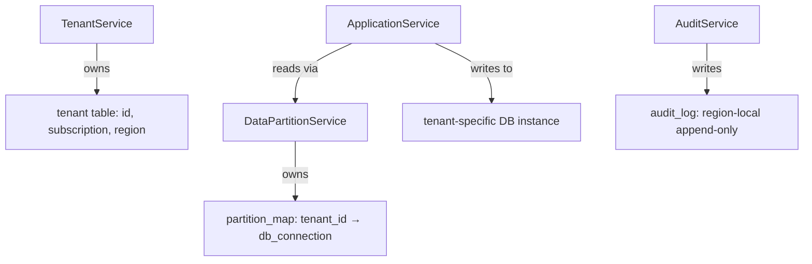

# mino-driven-design-skills

> Skill by [ara.so](https://ara.so) — Design Skills collection.

This skill enables AI agents to apply systematic design principles extracted from Mino-san's public materials. It guides you through problem framing, domain modeling, contract-based design, interface/implementation separation, architecture quality strategy, and reproducible development workflows—before, during, and after implementation.

**Core philosophy**: Don't confuse problems with solutions. Track requirements from natural language through models, contracts, public operations, and tests. Use evidence (code, contract tests, quality scenarios, independent validation) rather than explanations. Let humans own final value judgments, public contracts, irreversible decisions, and release approval.

## What This Skill Provides

The suite contains **independent skills** for different phases:

| Skill | When to Use | Primary Artifacts |
|-------|-------------|-------------------|
| `mino-core` | Common decision framework (usually invoked by other skills) | Problem Frame, Context Packet, Requirement Catalog |
| `mino-problem-framing` | Separate observations, assumptions, problems, objectives, success criteria before designing | Problem Framing Package |
| `mino-domain-model-completeness` | Audit for missing concepts, states, constraints, failures, authorities in a use case | Completeness Package |
| `mino-design-by-contract` | Convert natural language requirements into preconditions, postconditions, invariants, failure guarantees, contract tests | Contract Package |
| `mino-interface-implementation-separation` | Identify caller-side branching and technical leakage; design boundaries around intent and contract | Boundary Package |
| `mino-architecture-quality-strategy` | Design system-wide structure, data ownership, quality trade-offs, migration, recovery | Architecture Strategy Package |
| `mino-reproducible-development` | Integrate multiple design artifacts with implementation, review, and independent verification for medium-to-large changes | Implementation Spec, Verified Change, Review Result, or Reproduction Report |

## Installation

Clone the repository and reference the `.agents/skills/` directory from your AI agent configuration:

```bash
git clone https://github.com/my-take-dev/inspired-mino-design-skills.git
cd inspired-mino-design-skills
```

### Adding to Your Project

Create or update `.agents/AGENTS.md` in your project:

```markdown
# Skill Composition

When a request matches multiple Skills:

- Use the Skill that best matches the primary outcome as the basic workflow.
- Add only relevant language-, framework-, or tool-specific Skills to supplement that workflow.
- Let the basic Skill control scope, changes, validation, and the final response; specialized Skills provide their domain-specific guidance.
- Preserve every applicable Skill's exclusions, hard gates, and safety constraints.
- Follow the user's explicitly named Skills and do not add unrelated Skills.

## Skills

- [mino-driven-design-skills](./inspired-mino-design-skills/.agents/skills/)
```

## Skill Selection by Development Phase

| Phase | Skill | Developer Timing |
|-------|-------|------------------|
| Design | `mino-problem-framing` | Before implementation: organize the problem, objectives, assumptions, success criteria |
| Design | `mino-domain-model-completeness` | Check for missing business concepts, states, constraints, behaviors |
| Design | `mino-design-by-contract` | Convert requirements into testable conditions for normal and exceptional cases |
| Design | `mino-interface-implementation-separation` | Separate caller-facing operations from internal implementation choices |
| Architecture Design | `mino-architecture-quality-strategy` | Design system structure, data management, migration, recovery |
| Design + Implementation + Review | `mino-reproducible-development` | Medium-to-large changes requiring multiple design viewpoints through implementation and verification |
| Usually Not Direct | `mino-core` | Invoked by other skills; developers rarely call directly |

**Guidance**: For new features or major changes, start with `mino-problem-framing` to establish design premises. Then choose one design skill. Use `mino-reproducible-development` only when integrating multiple viewpoints through implementation and review. For small, mechanical changes (rename) with approved baseline problem/contract/data-meaning, this suite is unnecessary.

## Usage Patterns

### Pattern 1: Problem Framing Before Design

**Scenario**: You have a feature request but requirements are vague or solution-led.

```bash
# Request to AI agent:
"Help me frame this problem before designing: users complain the report is slow"
```

**Expected artifacts**:
- `Problem Framing Package` containing:
  - **Observations**: Current behavior, measurements, constraints
  - **Assumptions**: What we believe but haven't validated
  - **Problem Statement**: Core issue to solve
  - **Objectives**: Desired outcomes, not implementation
  - **Success Criteria**: Measurable, testable conditions

**Example output structure** (Markdown):

```markdown
# Problem Framing Package

## Observations
- Report generation takes 45s for 10,000 rows (measured 2026-07-14)
- Database query plan shows full table scan
- Users request report 200 times/day during business hours

## Assumptions
- Current database schema cannot be changed without migration plan
- Users expect <5s response for report generation
- Report content must remain accurate (no sampling trade-off)

## Problem Statement
Report generation exceeds user patience threshold due to query inefficiency.

## Objectives
- Reduce report generation time to <5s for typical dataset
- Maintain data accuracy and completeness
- Minimize infrastructure cost increase

## Success Criteria
- 95th percentile response time <5s for 10,000-row dataset
- Zero data discrepancies vs. current report
- Infrastructure cost increase <20%
```

### Pattern 2: Domain Model Completeness Audit

**Scenario**: You have a use case but want to find missing concepts, states, constraints.

```bash
# Request to AI agent:
"Verify my domain model is complete for order fulfillment use case"
```

**Expected artifacts**:
- `Completeness Package` with:
  - **Concept Coverage**: Entities, value objects, aggregates
  - **State Coverage**: Lifecycles, transitions, terminal states
  - **Constraint Coverage**: Invariants, business rules
  - **Failure Coverage**: Error conditions, compensations
  - **Authority Coverage**: Who can perform which operations

**Example output** (Markdown checklist):

```markdown
# Completeness Package: Order Fulfillment

## Concept Coverage
- [x] Order (aggregate root)
- [x] OrderLine (entity, child of Order)
- [x] Customer (reference)
- [x] Product (reference)
- [x] InventoryReservation (entity)
- [ ] **GAP**: ShippingAddress (value object) — currently string, needs validation
- [ ] **GAP**: PaymentMethod (value object) — no expiration tracking

## State Coverage
- [x] Order states: Draft, Submitted, Confirmed, Shipped, Delivered, Cancelled
- [ ] **GAP**: No "PartiallyShipped" state for multi-line orders
- [ ] **GAP**: No terminal failure state (what if payment fails after shipment?)

## Constraint Coverage
- [x] Order total = sum(OrderLine.price * OrderLine.quantity)
- [x] Cannot ship order with insufficient inventory
- [ ] **GAP**: No constraint for maximum order size
- [ ] **GAP**: No constraint preventing duplicate submissions

## Failure Coverage
- [x] Insufficient inventory → reject order
- [x] Payment declined → cancel order
- [ ] **GAP**: No compensation for shipped-but-unpaid orders
- [ ] **GAP**: No handling for partial inventory availability

## Authority Coverage
- [x] Customer can submit order
- [x] Warehouse can mark order shipped
- [ ] **GAP**: Who can cancel order after shipment?
- [ ] **GAP**: Can customer modify order after confirmation?
```

### Pattern 3: Design by Contract

**Scenario**: Convert natural language requirements into preconditions, postconditions, invariants, and contract tests.

```bash
# Request to AI agent:
"Convert these requirements into contracts with test oracles: order submission must validate inventory and reserve stock"
```

**Expected artifacts**:
- `Contract Package` with:
  - Preconditions (caller responsibilities)
  - Postconditions (operation guarantees)
  - Invariants (always-true conditions)
  - Failure guarantees (what's preserved on error)
  - Contract test oracles

**Example output** (TypeScript with contract tests):

```typescript
// contract/order-submission.contract.ts

/**
 * Contract: submitOrder
 * 
 * Preconditions:
 * - order.lines.length > 0
 * - order.customer exists and is active
 * - all order.lines[].product exist
 * 
 * Postconditions (success):
 * - order.state === OrderState.Submitted
 * - for each line: inventory.reserved >= line.quantity
 * - database transaction committed
 * 
 * Postconditions (failure):
 * - order.state unchanged
 * - no inventory reserved
 * - database transaction rolled back
 * 
 * Invariants:
 * - inventory.available + inventory.reserved === inventory.total (always)
 * - order.totalPrice === sum(line.price * line.quantity) (always)
 */

describe('Contract: submitOrder', () => {
  test('PRECONDITION VIOLATION: empty order lines → reject immediately', async () => {
    const order = { lines: [], customer: validCustomer };
    await expect(submitOrder(order)).rejects.toThrow(PreconditionError);
    // ORACLE: no database write, no inventory touch
    expect(await db.orders.count()).toBe(0);
    expect(await inventory.getReservations()).toHaveLength(0);
  });

  test('POSTCONDITION SUCCESS: sufficient inventory → order submitted + inventory reserved', async () => {
    const order = {
      lines: [{ product: 'P1', quantity: 5, price: 100 }],
      customer: validCustomer,
    };
    await inventory.setAvailable('P1', 10);

    const result = await submitOrder(order);

    // Postconditions
    expect(result.state).toBe(OrderState.Submitted);
    expect(await inventory.getReserved('P1')).toBe(5);
    expect(await db.orders.findById(result.id)).toBeDefined();
  });

  test('POSTCONDITION FAILURE: insufficient inventory → order unchanged + no reservation', async () => {
    const order = {
      lines: [{ product: 'P1', quantity: 15, price: 100 }],
      customer: validCustomer,
    };
    await inventory.setAvailable('P1', 10);

    await expect(submitOrder(order)).rejects.toThrow(InsufficientInventoryError);

    // Failure guarantee: no side effects
    expect(await db.orders.count()).toBe(0);
    expect(await inventory.getReserved('P1')).toBe(0);
  });

  test('INVARIANT: available + reserved === total (always maintained)', async () => {
    const before = await inventory.get('P1');
    expect(before.available + before.reserved).toBe(before.total);

    const order = {
      lines: [{ product: 'P1', quantity: 5, price: 100 }],
      customer: validCustomer,
    };
    await submitOrder(order);

    const after = await inventory.get('P1');
    expect(after.available + after.reserved).toBe(after.total);
  });
});
```

### Pattern 4: Interface/Implementation Separation

**Scenario**: Identify caller-side branching and technical leakage; design boundaries around intent.

```bash
# Request to AI agent:
"Separate interface from implementation properly for notification sending"
```

**Expected artifacts**:
- `Boundary Package` with:
  - Caller intent (what, not how)
  - Public contract
  - Hidden implementation choices
  - Eliminated caller-side branching

**Example output** (Go):

```go
// BEFORE: caller must know implementation details
func NotifyUser(userID string, message string, useEmail bool, useSMS bool) error {
    if useEmail {
        return emailService.Send(userID, message) // caller decides transport
    }
    if useSMS {
        return smsService.Send(userID, message)
    }
    return errors.New("no notification method specified")
}

// PROBLEM: caller must know
// - which transports exist
// - how to choose between them
// - transport-specific error handling

// AFTER: caller expresses intent; implementation chooses transport
type NotificationIntent struct {
    UserID  string
    Message string
    Urgency UrgencyLevel // High, Normal, Low
}

type NotificationService interface {
    // Contract:
    // - Precondition: intent.UserID exists, intent.Message non-empty
    // - Postcondition: at least one transport attempted; user preferences respected
    // - Failure guarantee: logs delivery attempts; no partial state
    Notify(ctx context.Context, intent NotificationIntent) error
}

type notificationService struct {
    userPrefs UserPreferenceRepository
    transports []Transport // email, SMS, push, etc.
}

func (s *notificationService) Notify(ctx context.Context, intent NotificationIntent) error {
    // Implementation chooses transport based on:
    // - user preferences (hidden from caller)
    // - urgency level (caller specifies WHAT urgency means, not HOW to handle it)
    // - transport availability (hidden from caller)

    prefs, err := s.userPrefs.Get(ctx, intent.UserID)
    if err != nil {
        return fmt.Errorf("load user preferences: %w", err)
    }

    candidates := s.selectTransports(intent.Urgency, prefs)
    for _, transport := range candidates {
        err := transport.Send(ctx, intent.UserID, intent.Message)
        if err == nil {
            return nil // success on first available
        }
        log.Warn("transport %s failed: %v", transport.Name(), err)
    }

    return errors.New("all transports failed")
}

// Caller code (simplified):
func HandleOrderShipped(orderID string) error {
    // Caller only expresses INTENT, not implementation
    return notificationService.Notify(ctx, NotificationIntent{
        UserID:  order.CustomerID,
        Message: fmt.Sprintf("Order %s shipped", orderID),
        Urgency: UrgencyNormal,
    })
}
```

**Key improvements**:
- Caller no longer branches on transport type
- Transport selection logic hidden in implementation
- User preferences hidden from caller
- New transports can be added without changing caller

### Pattern 5: Architecture Quality Strategy

**Scenario**: System-wide design with quality trade-offs, data ownership, migration, recovery.

```bash
# Request to AI agent:
"Design architecture quality strategy for multi-tenant SaaS with data sovereignty requirements"
```

**Expected artifacts**:
- `Architecture Strategy Package` with:
  - Quality portfolio (optimized vs. constrained vs. deliberately not optimized)
  - Module structure and data ownership
  - Cross-cutting concerns (observability, security, resilience)
  - Migration and recovery strategy
  - Trade-off decisions with rationale

**Example output** (Markdown):

```markdown
# Architecture Strategy Package: Multi-Tenant SaaS with Data Sovereignty

## Quality Portfolio

| Quality Attribute | Strategy | Rationale |
|-------------------|----------|-----------|
| **Data Sovereignty** | OPTIMIZE | Legal requirement (GDPR, regional laws); business differentiator |
| **Tenant Isolation** | OPTIMIZE | Security compliance, blast radius containment |
| **Write Throughput** | CONSTRAIN | Acceptable: <1000 writes/sec per tenant; focus on read scale instead |
| **Deployment Speed** | CONSTRAIN | Acceptable: monthly releases; zero-downtime more important |
| **UI Response Time** | OPTIMIZE | User retention depends on <200ms perceived latency |
| **Storage Cost** | NOT OPTIMIZED | Growth projections show compute cost >> storage cost |

## Module Structure & Data Ownership

### Modules
- **TenantService**: owns Tenant identity, subscription, region assignment
- **DataPartitionService**: owns physical data location, region mapping
- **ApplicationService**: owns business logic, reads from correct partition
- **AuditService**: owns compliance logs, immutable append-only store

### Data Ownership


### Data Sovereignty Implementation
- Each tenant assigned to **region** at creation (immutable)
- Tenant data stored in **region-local database instance**
- Cross-region queries **prohibited** (enforced at DataPartitionService)
- Audit logs **replicated regionally**, never cross-border

## Cross-Cutting Concerns

### Observability
- **Tenant context** propagated in all log lines, traces
- **Region tag** on all metrics for sovereignty compliance verification
- **Audit trail** for data access: who, what, when, from which region

### Security
- **Row-level security** enforced at database: `WHERE tenant_id = current_tenant()`
- **Region boundary enforcement**: application cannot request cross-region data
- **Encryption at rest**: per-region keys managed by regional KMS

### Resilience
- **Regional failover**: each region has standby database
- **No cross-region dependency**: region failure isolated
- **Degraded mode**: read-only access if write database unavailable

## Migration Strategy

### New Tenant Onboarding
1. Assign region based on user-selected data residency
2. Provision tenant-specific schema in region-local database
3. Write `tenant_id → region → db_connection` to partition map
4. Verify audit log pipeline active before allowing first write

### Existing Tenant Region Change (rare, compliance-driven)
1. Legal approval required (documented in audit log)
2. Create target region schema
3. Replicate data to target region (using encrypted channel)
4. Verify data integrity (checksum comparison)
5. Atomically update partition map: `tenant_id` → new region
6. Wipe source region data after retention period

## Recovery Strategy

### Regional Database Failure
- **RTO**: 5 minutes (automatic failover to standby)
- **RPO**: 0 (synchronous replication to standby)
- **Procedure**: DNS flip to standby; promote standby to primary

### Accidental Data Deletion
- **Audit log** provides point-in-time reference
- **Backup retention**: 30 days, region-local encrypted backups
- **Procedure**: restore from backup to staging; verify tenant; promote to production

### Sovereignty Violation (data leaked cross-region)
- **Detection**: audit log alerting on cross-region access attempts
- **Response**: immediate revocation of compromised credentials; incident log
- **Remediation**: verify no data exfiltrated; notify affected tenants per GDPR

## Trade-Off Decisions

| Decision | Chosen | Rejected | Rationale |
|----------|--------|----------|-----------|
| Multi-tenancy model | **Separate DB per tenant** | Shared DB with row-level security | Data sovereignty requires physical separation; blast radius containment |
| Cross-region reads | **Prohibited** | Allowed with replication lag | Sovereignty compliance more important than read convenience |
| Tenant migration | **Rare, manual, audited** | Self-service | Legal risk too high; compliance verification required |
| Storage cost | **Not optimized** | Aggressive compression | Development velocity and sovereignty enforcement more valuable |
```

### Pattern 6: Reproducible Development Workflow

**Scenario**: Medium-to-large change requiring multiple design artifacts, implementation, and independent verification.

```bash
# Request to AI agent:
"Apply mino reproducible development workflow for adding payment retry logic"
```

**Expected artifacts**:
- Problem Frame (why this change)
- Requirement Catalog (what must be satisfied)
- Design artifacts (contracts, model, boundary)
- Implementation Spec (how it will be built)
- Verified Change (evidence tests pass)
- Review Result (human approval + rationale)

**Workflow**:

```bash
# 1. Problem Framing
# AI agent creates Problem Framing Package

# 2. Design Selection
# AI agent applies relevant design skills:
# - mino-design-by-contract (retry contract, failure guarantees)
# - mino-domain-model-completeness (PaymentAttempt entity, states)

# 3. Implementation Spec
# AI agent produces:
# - Code changes
# - Contract tests
# - Migration plan (if schema changes)

# 4. Verification
# AI agent runs:
# - Contract tests (preconditions, postconditions, invariants)
# - Regression tests
# - Platform parity (if multi-platform)

# 5. Review Package
# AI agent generates review artifacts:
# - Design rationale
# - Test evidence
# - Quality scenario coverage
# - Breaking change analysis

# 6. Human Approval
# Developer reviews, approves, or requests changes
```

**Example Implementation Spec** (partial):

```markdown
# Implementation Spec: Payment Retry Logic

## Problem Reference
See `docs/problem-frames/payment-retry-2026-07.md`

## Design Artifacts
- Contract: `contracts/payment-retry.contract.md`
- Model: `models/payment-attempt.md`

## Code Changes

### New Entity: PaymentAttempt
```typescript
// src/domain/payment-attempt.ts
export enum PaymentAttemptState {
  Pending = 'pending',
  Succeeded = 'succeeded',
  Failed = 'failed',
  Retrying = 'retrying',
}

export interface PaymentAttempt {
  id: string;
  orderId: string;
  amount: Money;
  state: PaymentAttemptState;
  attemptNumber: number; // 1-based
  lastAttemptAt: Date;
  nextRetryAt: Date | null;
  failureReason: string | null;
}

// Invariant: attemptNumber >= 1
// Invariant: if state === Retrying, nextRetryAt !== null
// Invariant: if state === Succeeded, nextRetryAt === null
```

### Retry Contract
```typescript
// src/services/payment-retry.service.ts

/**
 * Contract: retryPayment
 * 
 * Preconditions:
 * - attempt.state === PaymentAttemptState.Failed || Retrying
 * - attempt.attemptNumber < MAX_RETRY_ATTEMPTS (3)
 * - Date.now() >= attempt.nextRetryAt
 * 
 * Postconditions (success):
 * - attempt.state === Succeeded
 * - attempt.nextRetryAt === null
 * - order.paymentStatus === Paid
 * 
 * Postconditions (retriable failure):
 * - attempt.state === Retrying
 * - attempt.attemptNumber += 1
 * - attempt.nextRetryAt set (exponential backoff)
 * 
 * Postconditions (terminal failure):
 * - attempt.state === Failed
 * - attempt.nextRetryAt === null
 * - order.paymentStatus === PaymentFailed
 * 
 * Failure guarantee:
 * - No double-charge (idempotency key used)
 * - Audit log entry for every attempt
 */
export async function retryPayment(attemptId: string): Promise<PaymentAttempt> {
  // implementation
}
```

### Contract Tests
```typescript
// tests/payment-retry.contract.test.ts

describe('Contract: retryPayment', () => {
  test('PRECONDITION: max attempts reached → reject', async () => {
    const attempt = await createFailedAttempt({ attemptNumber: 3 });
    await expect(retryPayment(attempt.id)).rejects.toThrow(MaxAttemptsExceededError);
  });

  test('POSTCONDITION SUCCESS: payment succeeds → state=Succeeded, no nextRetry', async () => {
    mockPaymentGateway.setNextResult('success');
    const attempt = await createFailedAttempt({ attemptNumber: 1 });

    const result = await retryPayment(attempt.id);

    expect(result.state).toBe(PaymentAttemptState.Succeeded);
    expect(result.nextRetryAt).toBeNull();
    expect(await getOrder(result.orderId)).toHaveProperty('paymentStatus', 'Paid');
  });

  test('POSTCONDITION RETRIABLE FAILURE: transient error → state=Retrying, nextRetry set', async () => {
    mockPaymentGateway.setNextResult('transient_error');
    const attempt = await createFailedAttempt({ attemptNumber: 1 });

    const result = await retryPayment(attempt.id);

    expect(result.state).toBe(PaymentAttemptState.Retrying);
    expect(result.attemptNumber).toBe(2);
    expect(result.nextRetryAt).toBeInstanceOf(Date);
    expect(result.nextRetryAt!.getTime()).toBeGreaterThan(Date.now());
  });

  test('FAILURE GUARANTEE: no double-charge on retry', async () => {
    mockPaymentGateway.setNextResult('success');
    const attempt = await createFailedAttempt({ attemptNumber: 1 });

    await retryPayment(attempt.id);
    const charges = mockPaymentGateway.getCharges(attempt.orderId);

    expect(charges).toHaveLength(1); // only one charge despite retry
  });
});
```

## Verification Evidence
- [x] Contract tests pass (12/12)
- [x] Regression tests pass (148/148)
- [x] No breaking changes to public API
- [x] Audit log integration verified

## Quality Scenarios Covered
- Payment gateway transient failure → automatic retry with exponential backoff
- Payment gateway permanent failure → no retry, order marked PaymentFailed
- Max retry attempts reached → terminal failure, alert operations team
- Idempotency: duplicate retry request → no double-charge
```

## Configuration

No global configuration required. Each skill documents its own modes and gates in its `SKILL.md`:

- `mino-core`: defines common decision gates (Problem Frame, Context Packet)
- `mino-problem-framing`: entry mode (observation → problem → objective)
- `mino-domain-model-completeness`: audit mode (find gaps)
- `mino-design-by-contract`: contract generation mode
- `mino-interface-implementation-separation`: boundary analysis mode
- `mino-architecture-quality-strategy`: system-wide design mode
- `mino-reproducible-development`: integration mode (problem → design → implementation → verification)

## Platform Support

| Platform | Structural Validation | Fixture Runner | Native Evidence | Status |
|----------|----------------------|----------------|-----------------|--------|
| Linux (Bash 3.2+) | ✅ | ✅ | ✅ | Pass |
| Windows (PowerShell) | ✅ | ✅ | ✅ | Pass |
| WSL | ✅ (as Linux) | ✅ (as Linux) | ✅ | Pass |
| macOS (Bash 3.2) | ✅ | ❌ (failed run 29397674053) | ⚠️ | Fail |

**macOS status**: Structural validator passes; fixture runner fails on `solver-nested-metadata` portable rewrite (exit 2). macOS support implemented but not released until native job passes.

## Troubleshooting

### "Skill not activating"

**Symptom**: AI agent doesn't apply mino principles when asked.

**Solution**:
1. Verify `.agents/AGENTS.md` references the skill directory.
2. Use explicit skill name in request: `"apply mino-problem-framing to this feature request"`
3. Check skill triggers match your phrasing (see YAML frontmatter in each `SKILL.md`).

### "Multiple skills conflicting"

**Symptom**: AI agent applies both mino skill and framework-specific skill, producing conflicting guidance.

**Solution**:
1. Follow Skill Composition rules (see "Adding to Your Project" section).
2. Choose the skill that matches the **primary artifact**: if you want a Problem Frame, use `mino-problem-framing` as primary; if you want framework-specific code, use framework skill as primary and mino skill as supplement.
3. Explicitly state: `"Use mino-problem-framing as the primary workflow; add React-specific guidance only where relevant."`

### "macOS validation failing"

**Symptom**: You're on macOS and getting fixture runner errors.

**Solution**:
- Current head (`e47aaafb74a27cf2cc7d4bc9c64f74d1933f10db`) has known macOS fixture runner failure.
- Structural validation works; you can read and apply design principles manually.
- For automated validation, use Linux or WSL environment until macOS runner is fixed.
- Track: GitHub Actions run 29397674053, job ID 87294760529.

### "Contract tests failing after design"

**Symptom**: `mino-design-by-contract` produced contract tests, but they fail immediately.

**Solution**:
1. Verify **preconditions** are met in test setup.
2. Check **postconditions** match actual implementation behavior (contract may be stricter than code).
3. Contract failures are **expected** if implementation doesn't satisfy contract — fix implementation, not contract.
4. Use contract failures as **design feedback**: if contract is too strict, revisit requirements with human stakeholder.

### "Too many artifacts for small change"

**Symptom**: Small bug fix triggers full `mino-reproducible-development` workflow.

**Solution**:
- Don't use this suite for mechanical changes (rename, approved baseline).
- For small fixes with clear problem/contract, use single-skill mode: `mino-design-by-contract` only.
- Reserve `mino-reproducible-development` for medium-to-large changes requiring multiple design viewpoints.

## Key Principles Reference

1. **Problem ≠ Solution**: Separate observations, assumptions, problems, objectives, success criteria before proposing implementation.
2. **Requirements Traceability**: Track from natural language → model → contract → public operation → test → evidence.
3. **Completeness Auditing**: Find missing concepts, states, constraints, failures, authorities.
4. **Design by Contract**: Express as preconditions, postconditions, invariants, failure guarantees; validate with oracles.
5. **Interface/Implementation Separation**: Caller expresses intent; implementation chooses how; no caller-side technical branching.
6. **Quality Portfolio**: Explicitly choose optimized, constrained, and not-optimized quality attributes per business value.
7. **Evidence over Explanation**: Judge by contract tests, quality scenarios, independent validation—not AI narration.
8. **Human Ownership**: Final value judgment, public contract, irreversible decisions, release approval stay with humans.

## Related Skills

- Combine with **language-specific skills** (e.g., `typescript-expert`, `go-patterns`) for implementation details.
- Combine with **framework skills** (e.g., `react-design`, `nestjs-architecture`) for technology-specific patterns.
- Use mino skills for **design phase**; use framework skills for **implementation phase**.

## Learn More

- Repository: [https://github.com/my-take-dev/inspired-mino-design-skills](https://github.com/my-take-dev/inspired-mino-design-skills)
- Original materials: Mino-san's public resources (see repository `mino-doc/` for references)
- License: See repository LICENSE (suite
