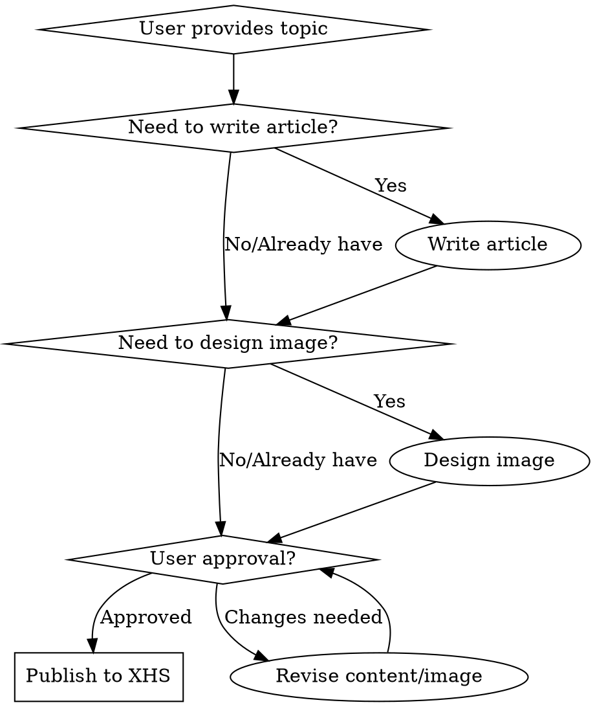

# Xiaohongshu Auto Publisher

## Overview
Automated end-to-end workflow for creating and publishing content to Xiaohongshu, from topic generation to final publication with user review checkpoints.

## When to Use



**Use when:**
- User wants to publish content to Xiaohongshu from a topic
- Need complete workflow: writing → image design → review → publish
- Want user approval checkpoints before publishing
- Publishing formatted articles with images and hashtags

**Don't use when:**
- User only needs to write articles (use writing skills)
- User only needs image generation (use image generation skills)
- Already have content ready to publish (skip to publish step)

## Core Workflow

### Phase 1: Content Creation

**1. Article Writing**
- Topic provided by user
- Write engaging article with:
  - Catchy title (≤20 Chinese characters)
  - Well-structured body (800-1000 characters optimal)
  - Emoji usage for visual appeal
  - Clear sections with headers
  - Call-to-action at end

**Article Structure Template:**
```
标题：Hook式标题（20字内）

开头：场景化描述/痛点引入
正文：
  🔥 现象/背景
  💡 原因分析
  ⚡️ 核心内容/方法
  💰 价值/收益
  ⚠️ 注意事项/风险

结尾：互动提问，引导评论
```

**2. Cover Design with Text-to-Image Feature (RECOMMENDED)**

**Xiaohongshu Built-in Text-to-Image (文字配图):**
- ✅ Fast and integrated - no external tools needed
- ✅ 80+ template styles (10 categories × 8 sub-styles)
- ✅ Auto-fills content to body text
- ✅ Professional quality optimized for XHS

**Template Categories:**
1. 便签 (Note) - with color customization
2. 备忘
3. 手写
4. 光影
5. 边框
6. 简约
7. 清新
8. 涂鸦
9. 柔和
10. 札记

**Title vs Cover Text Principle:**
```
标题 (Title): 简洁吸引人 (≤20字)
  ↓  MUST BE DIFFERENT ↓
封面文案 (Cover Text): 展开说明、补充信息、价值点
```

**Example:**
- **标题**: "OpenClaw爆火！10大实用案例让效率翻倍"
- **封面文案**:
  ```
  AI时代新物种
  16万⭐GitHub爆款
  10个场景彻底解放双手
  ```

**Workflow:**
1. Click "文字配图" button on publish page
2. Enter cover text (different from title)
3. Click "生成图片"
4. Choose template style
5. Click "下一步" (Next)
6. Cover automatically generated + content auto-filled
7. Continue editing: add title, hashtags, etc.
8. Publish

**External Image Generation (Fallback):**

1. **Gemini Web (Free)**
   - Use baoyu-danger-gemini-web skill
   - Requires: One-time consent acceptance
   - Cost: Free
   - Quality: High, supports text and images

2. **BigModel AI (Paid - ¥0.4/image)**
   - API-based generation
   - Requires: API key from https://www.bigmodel.cn/
   - Cost: ¥0.4 per image
   - Quality: High, Chinese-optimized

3. **OpenAI/Google APIs**
   - Use baoyu-image-gen skill
   - Requires: API keys
   - Cost: Varies by provider
   - Quality: Excellent

### Phase 2: User Review

**3. Present Draft to User**
```markdown
## 📝 文章草稿

**标题：** [title]

**正文：** [content]

**图片：** [image paths or descriptions]

**话题标签：** [suggested hashtags]

---

请审核以上内容，确认后告诉我：
✅ "通过" - 我将立即发布
✅ "修改：[具体要求]" - 我将按你的要求调整
✅ "重新生成" - 我将重新创作
```

**4. Wait for User Approval**
- Do NOT proceed without explicit approval
- Acceptable approval signals:
  - "通过" / "ok" / "好的" / "发布"
  - Specific modification requests
- Revisions required? Update content → return to review step

### Phase 3: Publishing

**5. Publish to Xiaohongshu**

**Method Selection:**
- **Preferred:** Use mcp__xiaohongshu-mcp MCP tools
  - `publish_content` for image posts
  - `publish_with_video` for video posts
- **Fallback:** Use browser automation with playwright
  - Navigate to https://creator.xiaohongshu.com/publish/publish
  - Upload images
  - Fill title and content
  - Add hashtags
  - Click publish

**Publishing Checklist:**
- [ ] User approved content
- [ ] Images uploaded (local paths provided)
- [ ] Title formatted correctly (≤20 chars)
- [ ] Content formatted with line breaks
- [ ] Hashtags added (3-5 optimal)
- [ ] Publish button clicked
- [ ] Verify success message

## Quick Reference

| Step | Tool/Skill | Output |
|------|-----------|--------|
| 1. Write article | Content writing | Formatted markdown article |
| 2. Design images | baoyu-cover-image / baoyu-xhs-images | Image file paths |
| 3. Present draft | Markdown formatting | Review document |
| 4. Get approval | User communication | Approval confirmation |
| 5. Publish | mcp__xiaohongshu-mcp | Published post URL |

## Implementation

### Article Writing Tips

**Good XHS Articles:**
- Start with relatable scenario or question
- Use emoji as bullet points (🔥💡⚡️💰⚠️)
- Break into scannable sections
- End with engagement question
- Keep paragraphs short (2-3 sentences)

**Title Formula:**
- Pattern: [Topic] + [Benefit] + [Emotion/Impact]
- Examples:
  - "Clawdbot：AI小龙虾征服硅谷"
  - "5分钟学会：用AI搞定一周工作"
  - "实测有效！3个方法让你效率翻倍"

### Hashtag Strategy

**Choose 3-5 relevant hashtags:**
1. Broad topic: #AI工具 #生产力
2. Niche specific: #Clawdbot #自动化
3. Trending: Check XHS recommendations

**Research trending hashtags:**
- Use xiaohongshu MCP search tools
- Check "热门话题" section in create page
- Balance high-volume and specific tags

### Image Design Guidelines

**For infographics:**
- Use baoyu-infographic skill
- Layout: 20+ types available
- Style: Professional, clean, readable

**For XHS carousel:**
- Use baoyu-xhs-images skill
- 9 visual styles available
- 6 layout options
- Optimize for mobile viewing

**For covers:**
- Use baoyu-cover-image skill
- Eye-catching main visual
- Clear title text
- Match brand colors

## Publishing with MCP Tools

**Example: Image Post**
```javascript
// Publish image post
mcp__xiaohongshu-mcp__publish_content({
  title: "Clawdbot：AI小龙虾征服硅谷",
  content: "[文章内容]",
  images: ["/path/to/image1.png", "/path/to/image2.png"],
  tags: ["AI工具", "Clawdbot", "生产力"],
  schedule_at: "2026-01-27T20:00:00+08:00" // optional
})
```

**Example: Video Post**
```javascript
// Publish video post
mcp__xiaohongshu-mcp__publish_with_video({
  title: "[标题]",
  content: "[内容]",
  video: "/path/to/video.mp4",
  tags: ["标签1", "标签2"]
})
```

**Error Handling:**
- Certificate errors → Use browser automation fallback
- Login required → Trigger QR code login flow
- Upload failures → Verify file paths and formats
- Rate limiting → Wait and retry

## Publishing with Browser Automation (Fallback)

When MCP tools fail, use Playwright:

```javascript
// 1. Navigate to publish page
await page.goto("https://creator.xiaohongshu.com/publish/publish");

// 2. Click "上传图文"
await page.click('text=上传图文');

// 3. Upload images
const fileInput = await page.$('input[type="file"]');
await fileInput.setInputFiles(['/path/to/image.png']);

// 4. Fill title
await page.fill('textbox[placeholder*="标题"]', 'Your Title');

// 5. Fill content
await page.fill('textbox', 'Your content here...');

// 6. Add hashtags (click hashtag suggestions or type manually)
await page.click('text=#话题');
await page.click('text=#AI工具');

// 7. Click publish
await page.click('button:has-text("发布")');

// 8. Verify success
await page.waitForSelector('text=发布成功');
```

## Common Mistakes

### ❌ Skipping User Approval
**Bad:** Generates content → publishes immediately
**Good:** Generates content → presents for review → waits for approval → publishes

### ❌ Wrong Title Length
**Bad:** 50+ character titles that get truncated
**Good:** ≤20 Chinese characters, optimized for XHS display

### ❌ Poor Image Formats
**Bad:** GIF, Live Photo, or low-resolution images
**Good:** PNG/JPG/WEBP, ≥720×960, 3:4 to 2:1 aspect ratio

### ❌ No Hashtags
**Bad:** Publishing without hashtags, low discoverability
**Good:** 3-5 relevant hashtags balancing broad and niche topics

### ❌ Wall of Text
**Bad:** Long paragraphs without breaks
**Good:** Short sections, emoji bullets, clear headers

### ❌ Ignoring XHS Content Style
**Bad:** Formal blog-style posts
**Good:** Conversational, emoji-rich, mobile-optimized content

## Real-World Impact

**Before this skill:**
- Manual article writing: 30-60 minutes
- Image design tools learning curve: 1-2 hours
- Manual publishing process: 5-10 minutes
- Total time: 1.5-3 hours per post

**After this skill:**
- Automated article generation: 1-2 minutes
- Automated image design: 2-3 minutes
- Automated publishing: 1-2 minutes
- User review time: 2-5 minutes
- Total time: 6-12 minutes per post

**Efficiency gain:** 10-15x faster, consistent quality, built-in review checkpoints

## Example Session

**User:** "帮我发布一篇关于Clawdbot的文章"

**Assistant:**
1. Writes article about Clawdbot
2. Generates infographic images using baoyu-infographic
3. Presents draft for review:
   ```markdown
   ## 📝 文章草稿
   [标题、正文、图片、标签]
   ---
   请审核：✅通过 / ✅修改 / ✅重新生成
   ```
4. User: "✅通过"
5. Publishes using mcp__xiaohongshu-mcp
6. Confirms: "发布成功！笔记链接：[URL]"

## Advanced Features

### Scheduled Publishing
```javascript
// Schedule for specific time
schedule_at: "2026-01-27T20:00:00+08:00" // ISO 8601 format
// Supports: 1 hour to 14 days in advance
```

### Multi-Image Posts
- XHS supports up to 18 images per post
- First image = cover image
- Drag to reorder in browser UI
- Maintain consistent style across images

### Content Series
- Use "添加合集" feature in publisher
- Group related posts
- Increases discoverability

### Location Tagging
- Use "添加地点" for local businesses
- Increases local reach
- Relevant for location-based content
