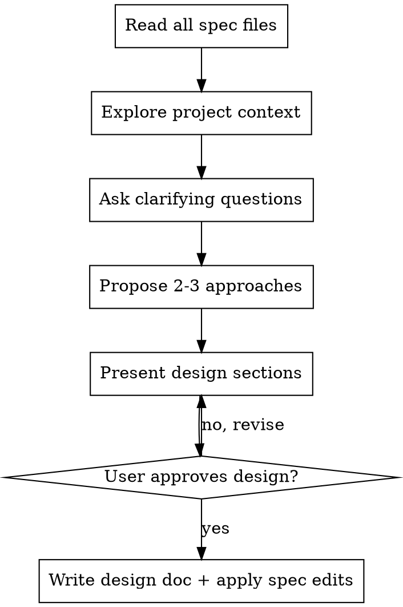

# Design

## Overview

Help turn specs into fully formed technical designs through natural collaborative dialogue.

Start by reading all spec files in the change's `specs/` directory to understand settled requirements, then brainstorm architecture by asking questions one at a time. Once the architecture is clear, present the design and get user approval. When writing the design doc, also apply any spec edits identified during the conversation.

<HARD-GATE>
Do NOT invoke any implementation skill, write any code, scaffold any project, or take any implementation action until you have presented a design and the user has approved it. Use the appropriate tool for asking the user a question or requesting input to get this approval. This applies to EVERY project regardless of perceived simplicity.
</HARD-GATE>

## Anti-Pattern: "This Is Too Simple To Need A Design"

Every project goes through this process. A todo list, a single-function utility, a config change — all of them. "Simple" projects are where unexamined assumptions cause the most wasted work. The design can be short (a few sentences for truly simple projects), but you MUST present it and get approval.

## Anti-Pattern: Asking About Requirements

The spec stage has already settled what the system should do. Do NOT ask questions about behaviors, boundaries, error conditions, or edge cases — those are for the spec skill. Focus exclusively on architecture, patterns, and technical trade-offs.

If you discover a gap in the specs during the design conversation, surface it as a spec implication ("This decision means we need a new scenario in spec Y") rather than re-opening the requirement discussion.

## Checklist

You MUST create a task for each of these items and complete them in order:

1. **Read all spec files** — read every file in the change's `specs/` directory before asking any architecture questions. Skip any you just wrote in this session.
2. **Explore project context** — read the specific files, modules, and interfaces that the spec requirements will touch. Skip areas you already explored during earlier steps in this session.
3. **Ask clarifying questions** — one at a time, about architecture, patterns, and technical trade-offs only
4. **Track spec implications** — when an architectural decision reveals a new requirement or changes a scenario, note it
5. **Propose 2-3 approaches** — with trade-offs and a recommendation
6. **Present design** — in sections scaled to their complexity, get user approval after each section
7. **Write the design document and apply spec edits** — write `design.md` in the change directory, then edit any spec files identified during the conversation

## Process Flow



## The Process

**Reading the specs:**
- If specs were written earlier in this session, re-read only to confirm exact wording
- Otherwise, read all `specs/**/*.md` files in the change directory
- Understand the settled requirements and any `<!-- deferred-to-design: ... -->` markers
- Deferred markers are explicit invitations to complete or revise those scenarios once you have architectural context

**Understanding the context:**
- Focus on the specific files, modules, and interfaces that the spec requirements will touch
- Skip areas you already explored in earlier steps of this session
- Use the spec files as the authoritative source of requirements

**Asking clarifying questions:**
- Follow the `codagent:ask-questions` skill for how to ask questions (tool to use, batching strategy, question quality)
- Focus on: technical approach, architecture, patterns, trade-offs, constraints
- Prefer multiple-choice questions when possible, but open-ended is fine too
- Do NOT ask about what the system should do — that is settled in the specs
- Ask targeted architecture questions after reading specs and exploring relevant code, unless the specs and codebase make the implementation approach obvious and low-risk. Questions should cover choices that affect components, interfaces, data flow, error handling, migration, tests, or rollout.
- Do NOT treat "does this design look right?" as the architecture discussion. Approval happens only after real trade-offs and unresolved technical choices have been surfaced.

**Tracking spec implications:**
- When an architectural decision reveals a new requirement or changes an existing scenario, surface it during the conversation: "This decision means we need to add scenario X to the spec for Y."
- Keep a running list of spec edits identified during the conversation
- Deferred-to-design scenarios should be completed or revised once you have the architectural answer

**Exploring approaches:**
- Propose 2-3 different approaches with trade-offs
- Present options conversationally with a recommendation and reasoning
- Lead with the recommended option and explain why

**Presenting the design:**
- Once the architecture is well understood, present the design
- Scale each section to its complexity: a few sentences if straightforward, up to 200-300 words if nuanced
- Use the appropriate tool for asking the user a question or requesting input to ask after each section whether it looks right so far
- Cover: architecture, components, data flow, error handling, testing
- Be ready to go back and clarify if something doesn't make sense

## After Approval

Write the design document using the Artifact Template below.

Then apply any spec edits identified during the conversation: add new scenarios, revise existing ones, or complete deferred-to-design scenarios. Edit the relevant spec files directly. Only add or revise scenarios — do not restructure the file.

This skill does not invoke other skills or manage sequencing.

## Key Principles

- **Read specs first** — Requirements are settled before this conversation begins
- **Architecture only** — Ask about "how", not "what"
- **Surface spec implications** — Don't silently ignore new requirements revealed by architecture
- **Use `codagent:ask-questions`** — For tool choice and batching strategy when gathering information
- **Questions before design text** — Ask specific architecture, trade-off, integration, failure-mode, and testing questions before presenting design sections
- **Multiple choice preferred** — Easier to answer than open-ended when possible
- **YAGNI ruthlessly** — Remove unnecessary features from all designs
- **Explore alternatives** — Always propose 2–3 approaches before settling
- **Incremental validation** — Present design, get approval before moving on
- **Be flexible** — Go back and clarify when something doesn't make sense
- **Capture implementation details** — Implementation details that came up in conversation but don't belong in behavioral specs (algorithms, data-structure choices, integration points, migration steps, error-handling strategies, etc.) **must** be captured here
- **Write for a different agent** — A separate implementing agent will read this design with no shared context from this conversation. Every decision, constraint, and technical detail must be in the written artifact

## Never

- Never present design sections or ask for approval before asking the appropriate architecture and trade-off questions.
- Never infer significant technical choices from the specs alone when a user answer would materially change the design.
- Never use the approval gate as a substitute for clarifying components, interfaces, data flow, error handling, testing, or rollout.

## Artifact Template

Use this structure when writing `design.md`. Scale each section to its complexity — omit sections that don't apply, keep simple sections to a few sentences.

```markdown
## Context

<!-- Background and current state -->

## Goals / Non-Goals

**Goals:**
<!-- What this design aims to achieve -->

**Non-Goals:**
<!-- What is explicitly out of scope -->

## Approach

<!-- The design itself: components, how they interact, data flow.
     Use diagrams where they help. This is the "what are we building" section. -->

## Decisions

<!-- Key design decisions and rationale -->

## Risks / Trade-offs

<!-- Known risks and trade-offs -->

## Migration Plan

<!-- Steps to deploy, rollback strategy (if applicable) -->

## Open Questions

<!-- Outstanding decisions or unknowns to resolve -->
```
