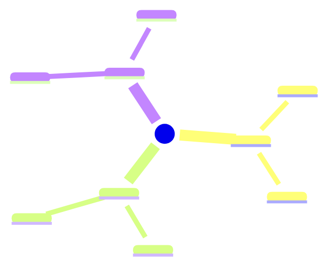
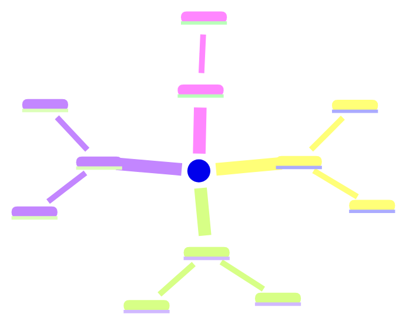

# Obsidian Research Orchestrator

## What this skill produces

For each research session, you write directly into the user's Obsidian vault:

- `MOC.md` — Master index with Mermaid mindmap and source list
- `<Concept-Name>.md` — One deep atomic note per major concept (800–1200 words each)
- `Key-Quotes.md` — All notable quotes with proper citations
- `Mindmap.md` — Standalone visual overview

**The non-negotiable standard:** Every atomic note must be self-contained and
genuinely educational. A reader with no prior knowledge of the topic should
finish the note understanding the concept clearly. Notes that just restate a
source title and link back to a URL are a failure — never do this.

---

## Phase 0 — Gather inputs before starting

Ask for anything missing. Do not begin Phase 1 until you have all required items.

| Input | Required | Default if missing |
|---|---|---|
| Topic / research question | Yes | — must ask |
| Vault path | Yes | — must ask |
| Folder name | Yes | Derived from topic |
| Sources (URLs, PDFs, YouTube, text) | At least one | Use internal knowledge only |
| Desired depth | No | Full depth (all phases) |

---

## Phase 1 — Ingest all sources in parallel

### Step 1a — Activate the virtual environment FIRST

Before running any fetch script, you must activate the Python virtual
environment. The libraries (`youtube-transcript-api`, `pdfplumber`,
`beautifulsoup4`) are installed inside the venv and will not be available
globally.

```bash
cd ~/.scripts/research-agent-obsidian
source venv/bin/activate
```

Verify activation succeeded — your shell prompt should show `(venv)` at the
start. If activation fails (path not found), stop and notify the user:
> "Could not activate venv at ~/.scripts/research-agent-obsidian/venv — 
> please confirm the venv exists or run: cd ~/.scripts/research-agent-obsidian && python3 -m venv venv && pip install youtube-transcript-api pdfplumber requests beautifulsoup4"

**The venv must remain active for the entire session.** All fetch scripts
below assume it is active. Do not deactivate between fetches.

---

### Step 1b — Fetch all sources simultaneously

With the venv active, run all fetches in parallel as subagents.
Use the correct script per source type.

### URL source
```bash
python3 ~/.scripts/research-agent-obsidian/fetch_url.py "<url>"
```

### PDF source
```bash
python3 ~/.scripts/research-agent-obsidian/fetch_pdf.py "<absolute/path/to/file.pdf>"
```

### YouTube source
```bash
python3 ~/.scripts/research-agent-obsidian/fetch_youtube.py "<full youtube url>"
```

### Plain text / pasted notes
No fetch needed — use content directly.

**On fetch failure:** Log `> ⚠ FETCH FAILED: <source>` in Key-Quotes.md and
continue. Never halt the session for one bad source. If more than half the
sources fail, notify the user before proceeding.

---

## Phase 2 — Deep synthesis (do this before writing a single file)

This phase is mandatory. Do not skip to writing files immediately after fetching.

Read all ingested content and build a full mental model of the topic. Extract:

### 2a. Concept map
List every distinct concept that appears across sources. Group related ones.
Identify which 4–8 concepts are substantial enough for their own atomic note.
Discard concepts that are minor variations of each other — merge them.

### 2b. Cross-source analysis
For each major concept, note:
- Which sources cover it and how deeply
- Where sources agree, extend each other, or contradict
- What evidence or examples each source provides
- What each source contributes that others do not

### 2c. Connection graph
For each concept, identify which other concepts it depends on, leads to, or
contrasts with. This becomes the `related:` frontmatter and the
`## Connections` section in each note.

### 2d. Open questions
What does the combined reading leave unresolved? What would a curious reader
want to explore next? These go into the MOC and each atomic note.

Only after completing this synthesis do you begin Phase 3.

---

## Phase 3 — Write files iteratively (one concept at a time, fully)

**Key rule: complete one file entirely before starting the next.**

Do not write skeleton files and fill them in later. Do not write all frontmatters
first. Finish each file — every section, fully written — then move to the next.

### Writing order:
1. Create the vault folder
2. Write each atomic note fully (concept by concept)
3. Write Key-Quotes.md
4. Write MOC.md (last — it links to everything)
5. Write Mindmap.md

```bash
mkdir -p "<vault_path>/<FolderName>"
```

**Default vault path:** `~/documents/dharmin\ obsidian`
Ask the user if they want to use this or specify a different one before creating any folders.

---

## File templates

### ATOMIC NOTE template

Filename: `<Concept-Name>.md` using Title-Case-Kebab (e.g. `Vector-Embeddings.md`)

Each atomic note must be **800–1200 words** of substantive content. This is a
firm minimum. Short notes are incomplete notes.

```markdown
---
title: "<Concept Name>"
tags:
  - <topic-tag>
  - <concept-tag>
date: <YYYY-MM-DD>
related:
  - "[[<Related-Concept-1>]]"
  - "[[<Related-Concept-2>]]"
source-count: <N sources used for this note>
---

# <Concept Name>

## What it is

<Write 2–3 full paragraphs that define and explain this concept from first
principles. Do not assume the reader knows anything. Explain the core idea,
why it exists, and what problem it solves. Use plain language. This section
alone should be at least 200 words.>

## How it works

<Write 2–3 paragraphs explaining the mechanism, process, or internal logic of
this concept. If it is a technique, explain the steps. If it is a theory,
explain the reasoning chain. If it is a system, explain the components and
how they interact. Include specific details — not vague generalities. At least
150 words.>

## Why it matters

<1–2 paragraphs explaining the significance of this concept. What becomes
possible because of it? What would be harder or impossible without it? What
real-world impact does it have? At least 100 words.>

## Concrete examples

<Provide 2–3 specific, concrete examples. Each example should be a short
paragraph, not just a bullet. Good examples make the concept tangible.>

**Example 1: <name>**
<paragraph>

**Example 2: <name>**
<paragraph>

**Example 3: <name>** *(if applicable)*
<paragraph>

## Evidence from sources

<Synthesize what the ingested sources say about this concept. Do NOT just list
sources — explain what each source contributed to your understanding of this
concept. Attribute specific ideas or data to their source. At least 150 words.>

<cite specific data, findings, or arguments from the sources here>

> "<Exact quote that best captures this concept>"
> — <Author / Source Title>, <page N or timestamp MM:SS>

> "<Second quote if one exists>"
> — <Author / Source Title>, <page N or timestamp MM:SS>

## Connections to other concepts

- [[<Related-Concept-1>]] — <1 sentence explaining how they connect>
- [[<Related-Concept-2>]] — <1 sentence explaining how they connect>
- [[<Contrasting-Concept>]] — Contrasts because <reason>

## Common misconceptions

<List 1–3 things people commonly get wrong about this concept and correct them.
If no clear misconceptions exist from the sources, explain the most common
points of confusion instead.>

- **Misconception:** <what people think>
  **Reality:** <what is actually true>

## Questions to explore

- <A specific follow-up question this concept raises>
- <Another specific question>
- <A question about a limitation or edge case>
```

---

### KEY-QUOTES.MD template

```markdown
---
title: "Key Quotes — <Topic>"
tags:
  - <topic-tag>
  - quotes
date: <YYYY-MM-DD>
---

# Key quotes — <Topic>

Organized by source. Only verbatim quotes from ingested content appear here.
Paraphrases and summaries live in the atomic notes.

---

## <Source 1 Title>

> "<Exact quote text, verbatim from source>"

**Source:** [<Title>](<url or file path>) — p.<N> / <MM:SS timestamp>
**Concept:** [[<Atomic-Note-This-Relates-To>]]

---

> "<Second quote from same source>"

**Source:** [<Title>](<url>) — p.<N>
**Concept:** [[<Atomic-Note>]]

---

## <Source 2 Title>

> "<Quote>"

**Source:** [<Title>](<url>) — p.<N>
**Concept:** [[<Atomic-Note>]]

---

## Unverified / fetch-failed sources

<List any sources that could not be fetched. Do not include quotes from them.>
- ⚠ FETCH FAILED: <url or path> — skipped
```

**Citation rules — strictly enforced:**
- Only quote text that appears word-for-word in the ingested source
- If you cannot verify the exact wording, write a paraphrase in the atomic note instead — do not put it here
- Every quote must have: source title, link or path, page number or timestamp
- Never fabricate a quote. Never approximate a quote.
- A URL alone is never a citation — always include title and locator

---

### MOC.MD template (write this last)

```markdown
---
title: "<Topic> — Map of Content"
tags:
  - research
  - moc
  - <topic-tag>
date: <YYYY-MM-DD>
sources:
  - "<source1 title> — <url or path>"
  - "<source2 title> — <url or path>"
---

# <Topic>

## Overview

<Write 3–5 sentences that give a genuine, substantive overview of this topic.
Explain what it is, why it matters, and what the key tensions or open questions
are. This should read like a smart friend summarizing the topic — not a
dictionary definition.>

## Notes in this folder

| Note | What it covers |
|---|---|
| [[<Concept-1>]] | <one sentence description> |
| [[<Concept-2>]] | <one sentence description> |
| [[<Concept-3>]] | <one sentence description> |
| [[<Concept-4>]] | <one sentence description> |
| [[Key-Quotes]] | All verbatim quotes organized by source |
| [[Mindmap]] | Visual overview of the topic |

## Mindmap



## Key insights from this research

<Write 3–5 bullet points that capture the most important takeaways — things
that surprised you, resolved a question, or changed how you'd think about
the topic. Not just summaries of what the notes contain, but genuine
intellectual observations.>

- <insight 1>
- <insight 2>
- <insight 3>

## Open questions

- <Specific unanswered question this research raised>
- <Another specific question>
- <A question about practical application>

## Sources used

<List every source that was successfully ingested. Include title, type, and link.>

| Source | Type | Link |
|---|---|---|
| <Title> | URL / PDF / YouTube | [link](<url or path>) |
```

---

### MINDMAP.MD template (standalone visual)

```markdown
---
title: "<Topic> — Mindmap"
tags:
  - <topic-tag>
  - mindmap
date: <YYYY-MM-DD>
---

# <Topic> — Mindmap


```

---

## Mermaid mindmap rules (read carefully — violations break rendering)

Obsidian's Mermaid parser is strict. Follow these rules exactly:

### Indentation
- Use **2 spaces per level** — never tabs, never 4 spaces
- `root` = level 0 (no indent)
- First-level branches = 2 spaces
- Leaves = 4 spaces
- Sub-leaves = 6 spaces (use sparingly — deep nesting breaks layout)

### Node text
- Keep node text **under 30 characters** — long text wraps badly
- No special characters inside nodes: no `()`, `[]`, `{}`, `#`, `"` inside labels
- The root node uses double parentheses: `root((Label))`
- All other nodes are plain text: just `Label` with no brackets

### Valid example (copy this structure exactly):
```
mindmap
  root((AI Search))
    Uninformed Search
      BFS
      DFS
      Uniform Cost
    Informed Search
      A-Star
      Greedy BFS
    Key Concepts
      Heuristics
      State Space
```

### Invalid patterns that break Obsidian:
```
❌  root((AI Search Algorithms Overview))  — too long
❌  Breadth-First Search (BFS)             — parentheses inside label
❌  #search-algorithms                     — hash symbol
❌      BFS                                — 4-space indent (must be 2)
❌  "A* Algorithm"                         — quotes inside label
```

### Before writing any Mermaid block, verify:
1. Every indent is exactly 2 spaces (count them)
2. No node label exceeds 30 characters
3. No special characters in any label
4. The root line is exactly `  root((ShortName))` with 2-space indent
5. The block opens with `mindmap` on its own line, nothing else

---

## YAML frontmatter rules (fixes "Invalid properties" error)

Obsidian is strict about YAML. Follow these rules to avoid the red error banner.

### Tags — NEVER include `#` inside the tags array

```yaml
# ✅ CORRECT
tags:
  - research
  - ai-search
  - machine-learning

# ❌ WRONG — causes "Invalid properties" error
tags: [#ai-search, #machine-learning]
tags:
  - #research
```

### Wikilinks in frontmatter — always quote them

```yaml
# ✅ CORRECT
related:
  - "[[Vector-Embeddings]]"
  - "[[Attention-Mechanism]]"

# ❌ WRONG — may parse incorrectly
related: [[Vector-Embeddings]], [[Attention-Mechanism]]
```

### Dates — use ISO format

```yaml
# ✅ CORRECT
date: 2026-03-21

# ❌ WRONG
date: March 21 2026
date: 21/03/2026
```

### Always use the multiline tag format (never inline array with brackets)

```yaml
# ✅ CORRECT — always use this style
tags:
  - research
  - topic-name

# ❌ AVOID — prone to errors
tags: [research, topic-name]
```

---

## Depth standards — what "deep enough" means

Use this table to self-check each atomic note before writing the next one:

| Section | Minimum | What failure looks like |
|---|---|---|
| What it is | 200 words | One paragraph, vague definition |
| How it works | 150 words | Bullet list with no explanation |
| Why it matters | 100 words | Missing entirely |
| Concrete examples | 2 examples, 1 paragraph each | "Example: Google Search" (one line) |
| Evidence from sources | 150 words | Just a URL or source title |
| Connections | 2–3 links with reasons | [[Link]] with no explanation |
| Quotes | 1–2 verified quotes | Paraphrase passed off as quote |
| Questions | 2–3 specific questions | "What else is there to learn?" |

If a section is below minimum, expand it before moving to the next note.

---

## Quality checklist — run before declaring the session done

**YAML / structure**
- [ ] No `#` symbols inside any tags array
- [ ] All wikilinks in frontmatter are quoted: `"[[Note-Name]]"`
- [ ] Dates are in YYYY-MM-DD format
- [ ] Every file has title, tags, date in frontmatter

**Content depth**
- [ ] Every atomic note is 800+ words
- [ ] No note contains only a URL or source title as its content
- [ ] Every "How it works" section explains mechanism, not just restates the definition
- [ ] Every note has at least 2 concrete examples with full paragraphs

**Citations**
- [ ] Every quote in Key-Quotes.md is verbatim from source
- [ ] Every quote has title + link/path + page or timestamp
- [ ] No quote is fabricated or approximated

**Connections**
- [ ] Every atomic note has a `related:` frontmatter with at least 2 links
- [ ] Every `## Connections` section has explanatory sentences, not bare links
- [ ] MOC links to every note in the folder

**Mermaid**
- [ ] All indents are exactly 2 spaces
- [ ] No node label exceeds 30 characters
- [ ] No special characters in any label
- [ ] Mindmap renders without error (test: paste into Obsidian)

**Completeness**
- [ ] All successfully fetched sources are represented in the notes
- [ ] All fetch failures are logged in Key-Quotes.md
- [ ] MOC sources table lists every source used

---

## Handling edge cases

**Source is paywalled or blocked**
Log the failure. Use whatever abstract or preview text was accessible. Continue.

**Topic is too broad for one session**
If synthesis reveals more than 10 major concepts, pause and ask the user which
subtopics to prioritize. Write deep notes on 4–6 concepts rather than shallow
notes on all 10.

**Sources contradict each other**
Do not resolve the contradiction by choosing a side. Write a
`## Debate / disagreement` section in the relevant atomic note. Present both
positions with attribution and let the evidence speak.

**No external sources provided**
Proceed using internal knowledge. Add to frontmatter:
```yaml
knowledge-source: internal
external-sources: none
```
Note at the top of the MOC: "This research session used no external sources —
content is based on training knowledge only."

**PDF has no text layer (scanned document)**
Note the failure. Ask the user if they can provide the text or key passages
manually. Do not OCR — the fetch script will return garbage.

**YouTube transcript is auto-generated (garbled)**
Note that transcript quality may be low. Flag any quotes from this source as
`[auto-transcript — verify]` in Key-Quotes.md.

---

## Naming conventions

| File type | Filename format | Example |
|---|---|---|
| Folder | `Topic-Name` (Title-Kebab) | `AI-Search-Algorithms` |
| MOC | `[Topic-Name]-MOC.md` | `AI-Search-Algorithms-MOC.md` |
| Atomic note | `Concept-Name.md` (Title-Kebab) | `A-Star-Algorithm.md` |
| Key quotes | `Key-Quotes.md` | `Key-Quotes.md` |
| Mindmap | `Mindmap.md` | `Mindmap.md` |
| Tags | `kebab-case` (no `#`) | `ai-search`, `machine-learning` |