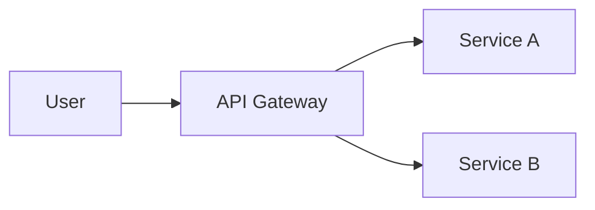
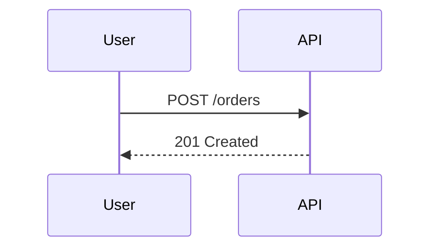

## Quick Start

**Prerequisites:**
- Git configured (`git config user.name` for author extraction)
- Write access to target directory

**Tools Used:** Read, Write, Edit, Bash (for git config, mkdir)

**Basic Usage:**
1. Determine document type (research, plan, docs, README, TODO, CHANGELOG)
2. Choose location based on type
3. Create directory if needed
4. Write with appropriate frontmatter (or none for special files)

## When to Use Me

Use this skill when you:
- Create, write, or generate new markdown (.md) files
- Edit, update, or modify existing markdown content
- Write research notes, findings, or analysis documents
- Create implementation plans, strategies, or roadmaps
- Build or update README files for projects or modules
- Manage TODO lists or CHANGELOG files
- Need to save agent research findings persistently

## Additional Triggers

Also use this skill when you:
- Fix markdown lint issues or formatting problems
- Reflow or wrap long lines in documentation
- Validate frontmatter structure or fix schema issues
- Check or fix broken links in documentation

## What I Do

- Create and edit markdown files with consistent structure
- Apply YAML frontmatter (title, author, timestamps, type, tags)
- Organize docs by type: research → `./docs/research/`, plans → `./docs/plans/`
- Handle special files (README, TODO, CHANGELOG) without frontmatter
- Generate descriptive kebab-case filenames
- Extract author from git config, manage ISO 8601 timestamps

## Document Type Quick Reference

| Type | Location | Frontmatter | Trigger Words |
|------|----------|-------------|---------------|
| Research | `./docs/research/` | Yes | research, analyze, investigate, explore |
| Plan | `./docs/plans/` | Yes | plan, strategy, roadmap, implementation |
| General | `./docs/` | Yes | document, guide, notes |
| README | Project/module root | No | readme, overview, project docs |
| TODO | Project root | No | todo, tasks, action items |
| CHANGELOG | Project root | No | changelog, releases, versions |

## Frontmatter Template

```yaml
---
title: Descriptive Title
created: 2025-12-25T14:30:00Z
last_modified: 2025-12-25T14:30:00Z
author: John Doe
type: research|plan|documentation
tags: [tag1, tag2]
---
```

## Common Errors

| Error | Cause | Solution |
|-------|-------|----------|
| Directory not found | Target path doesn't exist | Create with `mkdir -p ./docs/research/` |
| Author is "Unknown" | Git not configured | Run `git config user.name "Your Name"` |
| Frontmatter on README | Applied template to special file | README, TODO, CHANGELOG skip frontmatter |
| Filename collision | Generic name already exists | Use more specific descriptive name |
| Invalid timestamp | Wrong date format | Use ISO 8601 with UTC: `2025-12-25T14:30:00Z` |

## Diagrams and Callouts

Modern docs often include inline diagrams and callouts. Use these Markdown extensions where the renderer supports them.

### Mermaid Diagrams

GitHub, GitLab, and most static-site generators render ```` ```mermaid ```` fenced blocks into diagrams.

**Flowchart:**

````markdown

````

**Sequence diagram:**

````markdown

````

> Keep diagrams small. If a diagram needs more than ~15 nodes, split it or use the referenced `examples.md` for larger compositions.

### Admonitions (GitHub-Flavored)

GitHub renders blockquote-prefixed callouts as colored admonitions:

```markdown
> [!NOTE]
> Highlights information that users should take into account.

> [!TIP]
> Optional advice to help users be more successful.

> [!IMPORTANT]
> Crucial information necessary for success.

> [!WARNING]
> Critical content demanding immediate attention.

> [!CAUTION]
> Advises about risks or negative outcomes.
```

Other renderers (MkDocs `admonition`, Docusaurus, Hugo shortcodes) use different syntax — only emit `> [!TYPE]` when you know the renderer is GitHub or a GitHub-compatible adapter.

## References

| Reference | Load When |
|-----------|-----------|
| [examples.md](references/examples.md) | Need concrete examples of creating/editing documents |
| [document-types.md](references/document-types.md) | Need detailed guidance on document type conventions |

## Validation Checklist

- [ ] Document type identified (research, plan, docs, README, TODO, CHANGELOG)
- [ ] Location follows conventions
- [ ] Directory exists (create if needed)
- [ ] Filename is descriptive, kebab-case, no timestamp
- [ ] Frontmatter included only when appropriate
- [ ] Timestamps in ISO 8601 UTC format (ending in 'Z')
- [ ] When editing: preserve `created`/`author`, update `last_modified`

## Related Skills

| Skill | Use When |
|-------|----------|
| [skill-helper](../skill-helper/) | Validate and improve this SKILL.md markdown file |
| [retro](../retro/) | Format LESSONS.md and .retro/ archives |
