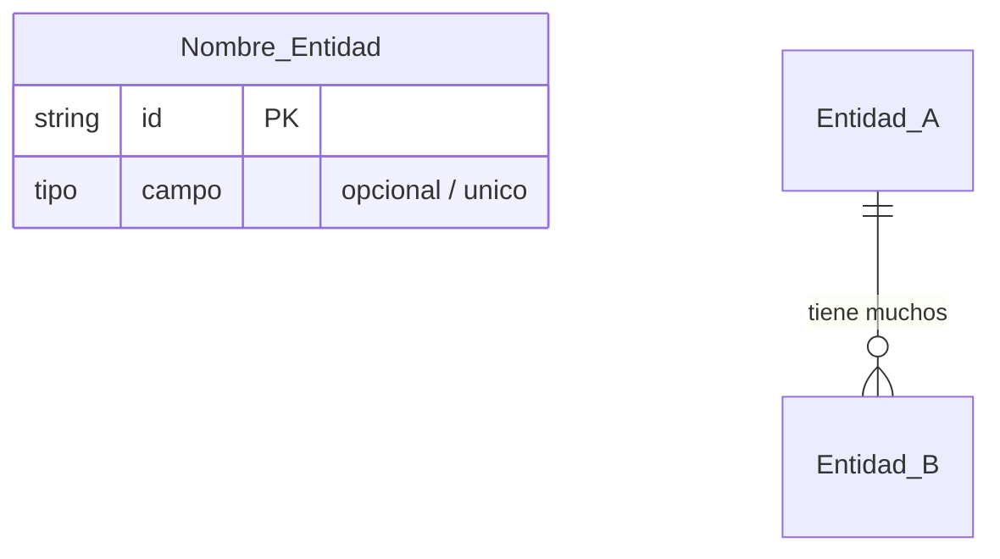
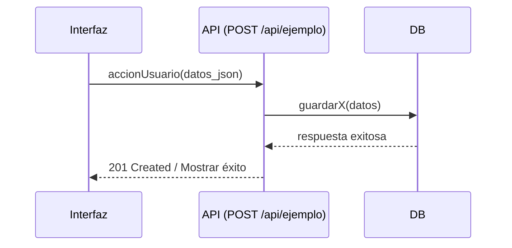
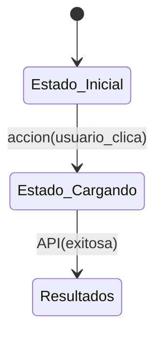

# Modelado de la Aplicación (Application Modeling)

Antes de empezar a programar, es imperativo modelar la aplicación para separar la *complejidad incidental* (la del problema real, que es inevitable) de la *complejidad accidental* (la que nos causamos nosotros mismos por una mala implementación).

**Regla de Oro:** Siempre documenta la estructura de alto nivel y los flujos de la aplicación en formato texto antes de codificar. No saltes directo al código.

## Tu tarea al usar esta skill

Cuando el usuario pida modelar una aplicación o si comienzas una funcionalidad desde cero, debes guiar al usuario para crear o actualizar un archivo `flows.md` en la raíz del proyecto (o la carpeta `docs`).

El archivo `flows.md` DEBE contener estas secciones obligatorias:

### 1. Diagramas de Entidad-Relación (ERD)
Documenta el modelo de datos y las relaciones entre entidades. Piensa en qué datos almacena la aplicación, las llaves primarias y foráneas.

**Formato a usar (Mermaid):**


### 2. Diagramas de Secuencia y API
Documenta el flujo de interacciones y define explícitamente los endpoints o métodos de comunicación.

**Formato a usar (Mermaid):**


### 3. Diagramas de Estado y UI
Documenta los estados de la aplicación y qué pasa en cada uno.

**Formato a usar:**
```text
## Nombre del Estado (clave_estado)

- **UI (Lo que ve el usuario):** Pantalla de carga o formulario específico.
- **Datos:** Estado actual del objeto (ej: "pendiente", "aprobado").
- **Background:** Tareas asíncronas o llamadas a API.
```

**Flujo de Estados (Mermaid):**


## Reglas de Implementación de esta Skill

1.  **Renderización Inmediata en Artifact:** Al proponer o actualizar el archivo `flows.md`, debes presentar SIEMPRE los diagramas usando un **Artifact** en formato Markdown (ej. un archivo en tu sistema de guardado `flujos_visuales.md`). De esta forma, el código de los bloques ````mermaid`` se compilará gráficamente de forma automática en la ventana especial de lectura y el usuario podrá iterar y validarlos visualmente de una vez.
2.  **Validación de Sintaxis:** Antes de presentar un diagrama Mermaid, verifica que no contenga caracteres prohibidos en los nombres de nodos y que la indentación sea correcta.
3.  **Contratos de API:** En la sección de secuencia, sé específico con los verbos HTTP (GET, POST, etc.) y los códigos de respuesta (200, 404, 500).
4.  **No Código sin Plan:** Rechaza amablemente la generación de código backend o frontend hasta que el `flows.md` esté aprobado por el usuario.
5.  **Comandos Rápidos (!model, !flows, "ver modelo"):** Si el usuario escribe alguno de estos comandos:
    - Verifica si ya existe el archivo `flows.md` en el proyecto actual.
    - **Si EXISTE:** Lee el archivo y crea inmediatamente el **Artifact** para visualizar gráficamente el contenido, sin modificar nada.
    - **Si NO EXISTE:** Revisa y analiza los archivos del proyecto actual (sus clases, modelos de base de datos, APIs, etc.) para inferir cómo funciona la aplicación. Luego, redacta un `flows.md` inicial apoyado en este análisis y finaliza generando el **Artifact** visual para que el usuario pueda iterarlo.

## Flujo de trabajo

1.  **Entrevista/Investigación:** Analiza los requerimientos y pregunta por entidades clave.
2.  **Creación de `flows.md`:** Crea el archivo con los diagramas visuales.
3.  **Revisión Iterativa:** Ajusta el modelo según el feedback visual del usuario.
4.  **Implementación:** Usa el `flows.md` como fuente de verdad absoluta para el código.
