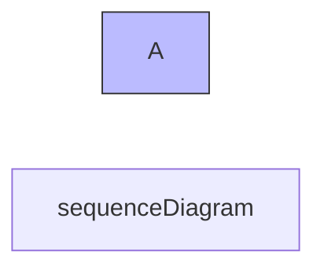
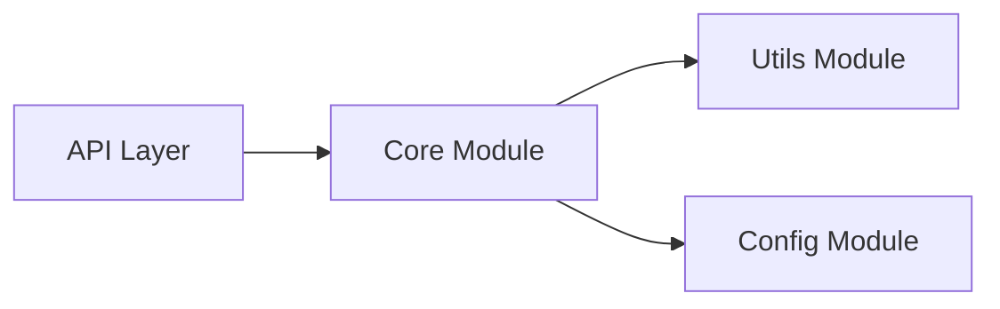
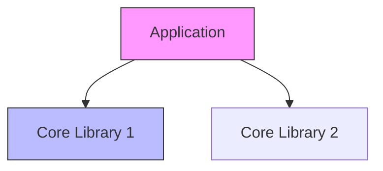
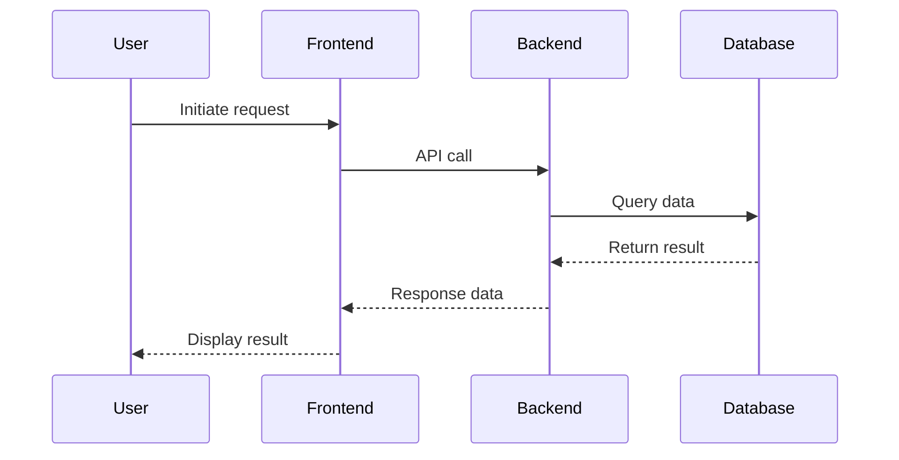
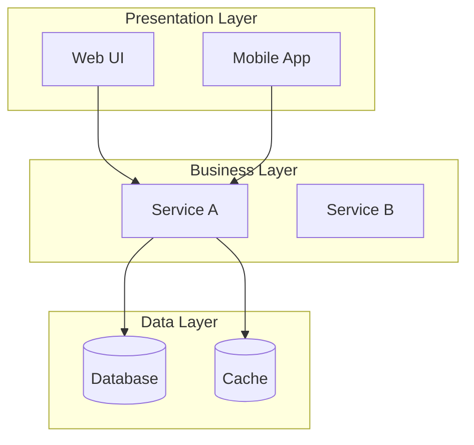
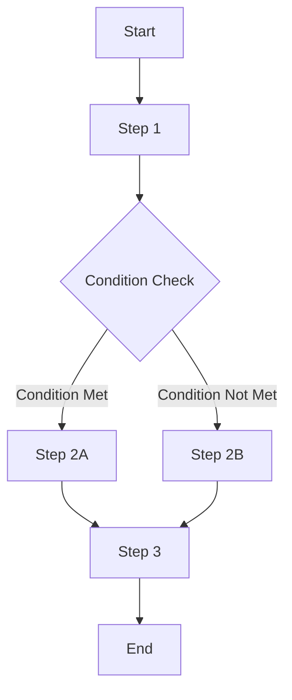
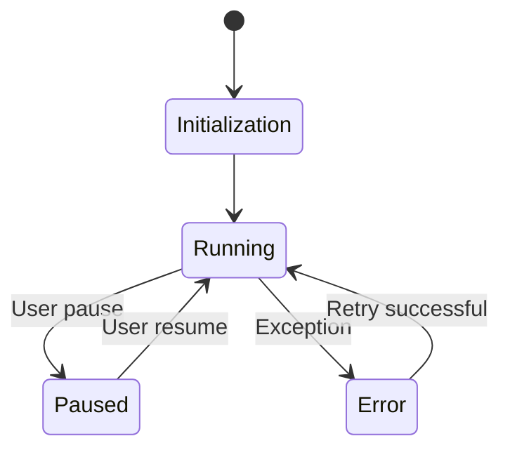
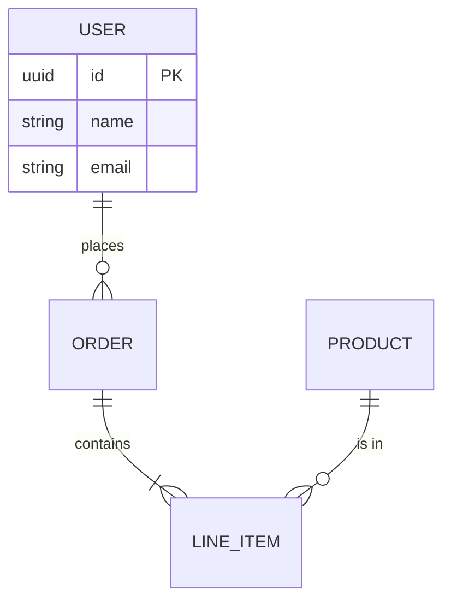
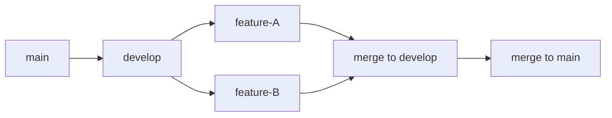

# Mermaid Diagram Skill - Syntax Rules & Bug Avoidance

Comprehensive guide for writing error-free Mermaid diagrams with proper syntax.

---

## 1. Bracket Matching (Most Critical Rule)

Opening and closing brackets **must match exactly**:

| Opening | Closing | Shape | Example |
|---------|---------|-------|---------|
| `[` | `]` | Rectangle | `A["Label"]` |
| `{` | `}` | Diamond | `D{"Decision"}` |
| `(` | `)` | Rounded | `R{"Label"}` |
| `([` | `])` | Stadium | `S(["Start"])` |
| `[[` | `]]` | Subroutine | `X[["Process"]]` |
| `[(` | `)]` | Cylinder | `DB[("Database")]` |

**NEVER mix**: `{Decision]` or `[Choice}` — these are syntax errors.

---

## 2. Node Labels - Always Use Double Quotes

**ALL node labels MUST be wrapped in double quotes** inside brackets:

```mermaid
%% Correct - safe from parsing errors
A["User: Analyze project"]
B["SKILL.md: Step 0 Preparation"]
C["Read TEMPLATE.md"]

%% WRONG - bare brackets are fragile
A[Label text]
```

### Special Characters That Break Bare Brackets

Labels containing these **must use double quotes**:

- Contains `@`: `ID["@ notification"]`
- Contains `[]`: `ID["items[0]"]`
- Contains `:` + `/`: `ID["CIDR: 10.0.0.0/16"]`
- Contains `<br/>` + `()`: `ID["Process<br/>(async)"]`
- Contains `{}`: `ID["Create ~/path/{project-name}/ dir"]` — `{}` is parsed as diamond
- **Contains `()` inside `[]`**: `ID["HTTP API (/admin, /api)"]`

---

## 3. Reserved Keywords - Never Use as IDs

These keywords (case-insensitive) **cannot be used as node/participant IDs**:

`loop`, `end`, `alt`, `opt`, `par`, `critical`, `break`

**Use suffixes instead**:
- `loop` → `LoopNode`
- `end` → `EndState`
- `alt` → `AltPath`

---

## 4. Node IDs - No Spaces Allowed

```mermaid
%% Correct
AIProviders["LLM APIs"]
user_flow_1["User Flow"]

%% WRONG - space causes parse error
AI Providers["LLM APIs"]
user flow 1["User Flow"]
```

Use camelCase or underscores: `MyNode`, `my_node`.

---

## 5. Edge Labels - Must Use `|"..."|`

```mermaid
%% Correct
A -->|"label text"| B

%% WRONG - missing closing | and target
A -->|"label text"
```

Every `-->|"..."|` must have a closing `|` followed by a destination node.

---

## 6. Comments - Use `%%` Only

```mermaid
%% This is a correct comment
A --> B
# WRONG - # causes parse error
```

---

## 7. sequenceDiagram Rules

### Participant References Must Match Declared IDs

```mermaid
%% Correct - message uses declared ID
participant G as Gateway
CH->>G: Route request

%% WRONG - uses display alias, not declared ID
participant G as Gateway
CH->>Gateway: Route request
```

### Message Syntax Requires Colon

```mermaid
%% Correct
A->>T: Tool result

%% WRONG - missing colon and text
A->>Tool Result
```

### No `style` Directive in sequenceDiagram

```mermaid
%% WRONG - style does not work here
sequenceDiagram
    style A fill:#f9f

%% Correct - use style only in graph/flowchart
graph LR
    style A fill:#f9f
```

### Note Syntax

```mermaid
Note over A,B: text  %% valid only in sequenceDiagram
```

---

## 8. graph/flowchart Rules

### `style` Directive Works Only Here



### Direction Choice

```mermaid
%% Correct for long chains (8+ nodes)
flowchart TD

%% Wrong for 8+ nodes - crushed horizontally
flowchart LR
```

Use `LR` only for short fan-out diagrams (≤7 nodes in longest chain).

### Subgraph Labels Must Not Match Child Node IDs

```mermaid
%% WRONG - causes cycle error
subgraph "Dedupe"
    Dedupe["Dedupe Cache"]
end

%% Correct - different names
subgraph "Dedupe"
    DedupeCache["Dedupe Cache"]
end
```

---

## 9. Fragile Diagram Types - Avoid

| Type | Issue | Alternative |
|------|-------|------------|
| `gitGraph` | Unreliable rendering | Use `graph LR` flowchart |
| Nested subgraphs with empty labels | Causes errors | Always use meaningful labels |
| Complex `stateDiagram` transitions | Fragile | Keep simple |

---

## 10. Self-Check List (11 Points)

Before saving any mermaid block, verify:

1. Every opening bracket has a matching closing bracket of the same type
2. No reserved keyword used as node/participant ID
3. No `style` in sequenceDiagram or stateDiagram
4. All subgraph labels quoted if they contain spaces
5. No `#` comments (use `%%`)
6. Labels containing `{}`, `[]`, `()` wrapped in double quotes
7. No spaces in node IDs — use camelCase or underscores
8. Every `-->|"label"|` has closing `|` and a target node
9. sequenceDiagram messages use declared participant IDs (not aliases)
10. Every `->>` / `-->>` message has a colon and text after target
11. Long linear chains (8+ nodes) use `TD` direction, not `LR`

---

## Diagram Type Reference

### Module Graph (LR) - Simple Dependencies



### Graph (TD) - Dependency Diagram with Style



### Sequence Diagram - User Flow



### Architecture with Subgraphs (TB)



### Flowchart with Decision



### State Diagram



### ER Diagram



### Git Branching (Use Flowchart, Not gitGraph)



---

## Quick Reference

| Rule | Correct | Wrong |
|------|---------|-------|
| Node label | `A["text"]` | `A[text]` |
| Edge label | `-->|"text"| B` | `-->|"text"` |
| Comment | `%% comment` | `# comment` |
| Node ID | `MyNode` | `My Node` |
| Reserved word | `LoopNode` | `loop` |
| Direction (long) | `flowchart TD` | `flowchart LR` |
