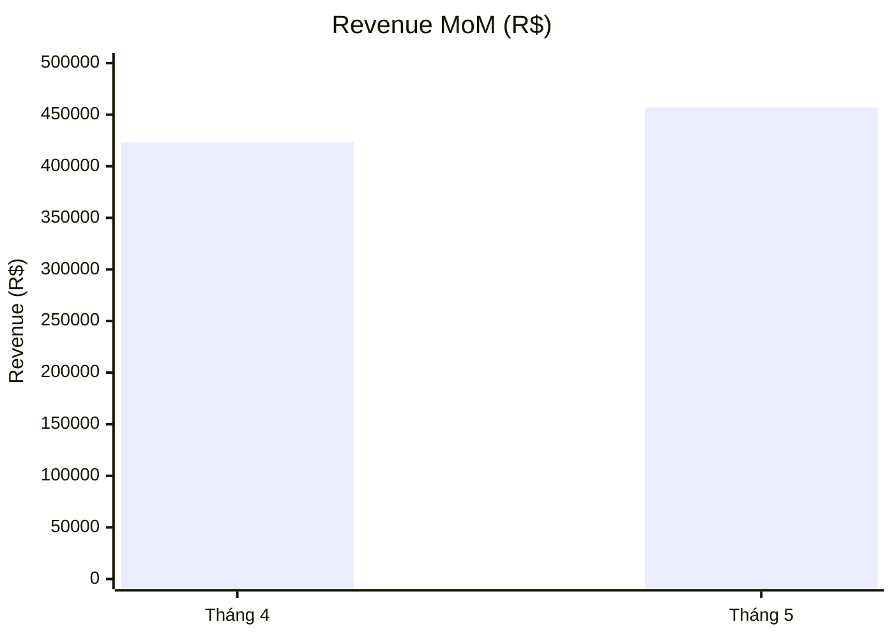
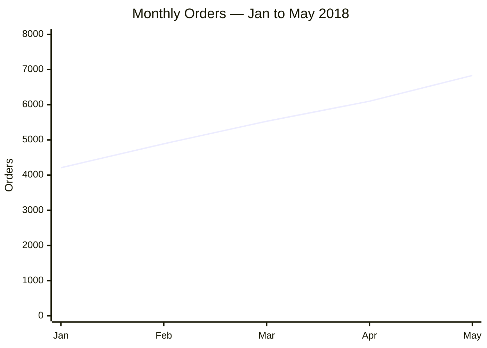
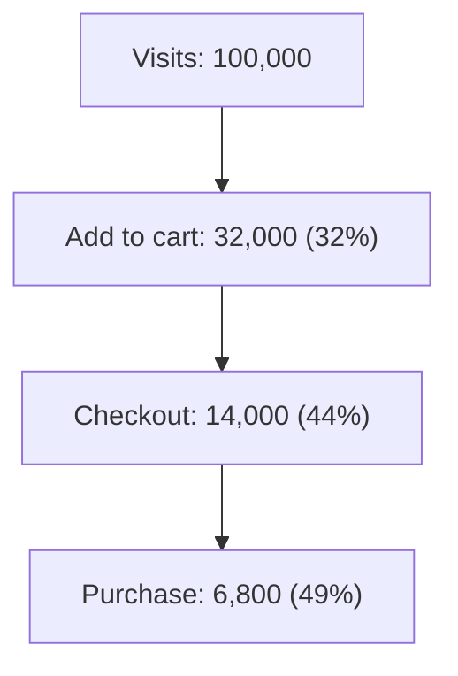

# Analysis Readout (Orchestrator)

## Purpose

Coordinate a sequence of atomic skills for open-ended analytics requests. This skill does not perform analysis itself — it runs the right atomic skills in the right order and assembles their outputs into a single report.

## When to use

- The user has a business question and a dataset but has not scoped the analysis type
- The ask is open-ended: "phân tích tình hình kinh doanh", "find what matters in this data", "tell me what's going on with X"
- The request likely requires more than one analytical lens before a recommendation is possible

## When not to use

- The user explicitly names a specific analysis type (use that atomic skill directly)
- The question is already fully scoped and one atomic skill is the clear match
- The ask is a single standalone memo or report with known inputs (use `stakeholder-memo` directly)

## Assumption policy

Proceed with stated assumptions. Do not stop to ask clarifying questions unless a required input (dataset, metric definition, timeframe) is genuinely missing and cannot be inferred. State assumptions explicitly at the top of the report instead.

## Evidence constraint

Every conclusion produced by any skill in this pipeline must be grounded in specific data — a number, a rate, a segment, or a timeframe. Do not speculate or assert without an evidential basis. If data is insufficient to support a conclusion, state explicitly what is missing rather than filling the gap with unsupported inference. When evidence is weak, use hedged language ("consistent with," "suggests," "leading hypothesis") rather than asserting certainty.

## Pipeline

The pipeline has four phases. The question assessment, steps 1–2, and the final step are fixed. The diagnostic phase (step 3) is dynamic.

```yaml
pipeline:

  # Phase 0 — always run first, before any analysis
  question_assessment:
    - skill: clarify-question
      required: true
      note: "Assess the user's question before any analysis begins. Identify missing elements (metric, dimension, grain, timeframe, baseline, filter, decision context). If elements are missing and cannot be inferred, ask the minimum clarifying questions. If the user cannot answer, state working assumptions explicitly and proceed. Do not skip this step even for seemingly clear questions."

  # Phase 1 — always run, in order
  fixed_foundation:
    - skill: data-quality-check
      required: true
      note: "Run after question assessment. Flag issues but do not stop — proceed with clean subset and document exclusions."

    - skill: metric-definition
      required: false
      condition: "Any key metric, KPI, or column label in the dataset is ambiguous, unnamed, or could be measured in multiple valid ways (e.g. revenue = gross or net? activation = what event?). Run before EDA so interpretation is grounded in agreed definitions."
      note: "Produces a metric spec for each ambiguous KPI. Output feeds directly into EDA framing."

    - skill: exploratory-data-analysis
      required: true
      note: "Summarize shape, distributions, trends, and anomalies. This is the factual foundation."

  # Phase 2 — dynamic dispatch: select any skills whose condition is met based on EDA findings
  # Run all triggered skills; run multiple in parallel where findings are independent.
  # No skill is pre-selected — the EDA output determines what runs.
  diagnostic_phase:
    select: "all skills whose condition is met"
    available:
      - skill: root-cause-analysis
        condition: "A metric changed, declined, or spiked, OR a 'why' question is in scope."
      - skill: segmentation-analysis
        condition: "An audience, product, channel, or regional breakdown would change the recommendation."
      - skill: cohort-retention
        condition: "Retention, repeat purchase, or time-since-first-event patterns are relevant."
      - skill: funnel-analysis
        condition: "A conversion funnel or sequential drop-off is in scope."
      - skill: forecasting-readout
        condition: "A forward-looking projection or trend extrapolation is needed."
      - skill: experiment-readout
        condition: "An A/B test, holdout, or intervention is present in the data."
      - skill: causal-inference-check
        condition: "A causal claim is made or implied by the user or by EDA findings."
      - skill: hypothesis-tree
        condition: "The problem space is unclear after EDA and needs structured decomposition."
      - skill: dashboard-critique
        condition: "The input dataset is a dashboard export or reporting artifact, OR the analysis output is intended to populate or review an existing dashboard."

  # Phase 2.5 — run after diagnostics, before synthesis
  # Triggered when analysis reveals gaps the current data cannot close.
  gap_resolution:
    - skill: data-request-spec
      required: false
      condition: "EDA or any diagnostic skill identifies a specific data gap — missing fields, unmeasured events, unavailable history — that would materially change a finding or leave a key recommendation unsupported."
      note: "Produces a precise request spec for data/engineering teams. Attach to the memo as an appendix so stakeholders see what is needed to close open questions."

  # Phase 3 — always the final step
  synthesis:
    - skill: stakeholder-memo
      required: true
      note: "Synthesizes all prior outputs into a decision-ready memo. Always the last step."

assumption_policy: "state working assumptions explicitly after clarify-question; do not stop mid-pipeline to re-clarify"
output_artifact: "report-{date}.md"
```

## Orchestration rules

1. Run `clarify-question` first — always. Assess metric, dimension, grain, timeframe, baseline, filter, and decision context. If elements are missing and cannot be inferred, ask. If the user cannot answer, state working assumptions explicitly and continue. Do not proceed to Phase 1 until the question is framed.
2. Run `data-quality-check`. Note data issues and the resulting analysis scope, then continue.
3. If any key metric or KPI label is ambiguous, run `metric-definition` before EDA to produce an agreed spec. Skip if definitions are already canonical.
4. Run `exploratory-data-analysis` on the clean dataset, using defined metrics from step 3. Extract key facts and surface candidate hypotheses.
5. After EDA, evaluate **all** diagnostic skills in `diagnostic_phase` against the findings. Select every skill whose condition is met — there is no fixed list. Run selected skills; where findings are independent, run in parallel. If no condition is met, skip the phase entirely.
6. After diagnostics, check whether any data gap was identified that would materially change a finding. If yes, run `data-request-spec` and attach its output as an appendix.
7. Pass all findings to `stakeholder-memo` as inputs. The memo is the deliverable — not the intermediate outputs.
8. Write the final report to `report-{date}.md` where `{date}` is today's date in YYYY-MM-DD format.

## Chart requirements

Every important KPI table in the report **must** be followed immediately by a Mermaid chart that visualizes the same data. Do not replace the table — the chart supplements it.

### When to add a chart

Add a Mermaid chart after any table that contains:
- A KPI comparison across time periods (MoM, QoQ, YoY)
- A metric breakdown by segment, category, region, or channel
- A trend with 3 or more data points
- A funnel or conversion rate sequence

Skip charts for: data-quality summary tables, metric definition tables, and appendix data-request specs.

### Chart type by data shape

| Data shape | Mermaid chart type |
|---|---|
| Two-period comparison (e.g. Apr vs May) | `xychart-beta` with `bar` |
| Time series / trend (≥3 periods) | `xychart-beta` with `line` |
| Category / segment breakdown | `xychart-beta` with `bar` |
| Funnel / sequential drop-off | `flowchart TD` with labeled nodes |
| Part-of-whole (top-N shares) | `pie` |

### Format rules

- Place the chart block **directly after** the table it visualizes, before any prose interpretation.
- Always include a `title` in the chart.
- Use the same metric labels and units as the table.
- Round values to integers or 1 decimal place — do not use raw floats.
- If the table has more than 8 rows, chart only the top 6 by magnitude and note "top 6 shown".

### Example — MoM KPI bar chart



### Example — trend line chart



### Example — funnel



## Output

The output is a single `stakeholder-memo`-format report. Do not surface raw intermediate outputs to the user unless they ask. The report structure follows `stakeholder-memo`:

- Decision question
- Scope and assumptions (including data quality notes)
- Key findings (from EDA and diagnostics)
- Interpretation
- Recommendation
- Risks and open questions

## Comparison with direct atomic skill use

| Pattern | When | Approach |
|---|---|---|
| Open question, new dataset | User asks "analyze X" | Use this orchestrator |
| Scoped question, clean data | User asks "write the A/B memo" | Use `experiment-readout` or `stakeholder-memo` directly |
| One analytical lens needed | User asks "show me cohort retention" | Use `cohort-retention` directly |

## Example

User: "phân tích tình hình kinh doanh Olist 2018"

Pipeline executed:
1. `clarify-question` → question framed: gross revenue trend for Olist Brazil, full year 2018, compared to 2017 baseline, by region and category; working assumption: no 2017 data available so YoY uses internal Q-over-Q as proxy
2. `data-quality-check` → 3 columns with nulls, date range confirmed 2018-01-01 to 2018-12-31, two duplicate order IDs removed
3. `metric-definition` ✓ triggered → "revenue" column ambiguous (gross vs. net of refunds); defined as gross order value before cancellations; "repeat purchase rate" defined as % of customers with ≥2 orders within 90 days
4. `exploratory-data-analysis` → revenue up 40% YoY but slowing in Q4; São Paulo drives 35% of orders; repeat purchase rate (as defined) declining
5. Diagnostic dispatch — conditions evaluated against EDA findings:
   - `root-cause-analysis` ✓ triggered (Q4 slowdown is a metric change)
   - `segmentation-analysis` ✓ triggered (regional breakdown changes recommendation)
   - `cohort-retention` ✓ triggered (repeat purchase rate decline surfaced in EDA)
   - `funnel-analysis` ✗ not triggered (no conversion funnel in scope)
   - `forecasting-readout` ✗ not triggered (no forward-looking question)
   - `dashboard-critique` ✗ not triggered (input is raw data, not a dashboard export)
   - All three triggered skills run; root-cause and segmentation run in parallel
6. `data-request-spec` ✓ triggered → diagnostics revealed customer acquisition channel missing; spec written for marketing attribution table
7. `stakeholder-memo` → final report written to `report-2026-04-09.md` with data-request-spec attached as appendix
